# Use Case Catalogue

Este documento captura todos los casos de uso identificados en el repositorio **vpn-proxy-agent**, agrupando los flujos que automatizan aprovisionamiento, operación, mantenimiento y desarrollo. Cada caso de uso describe el objetivo, los actores involucrados, los puntos de entrada dentro del código y los efectos esperados. Se incluyen diagramas UML tanto de alto nivel (actividad) como de bajo nivel (secuencia) para facilitar la comprensión end-to-end.

## Catálogo global

| ID | Caso de uso | Actor principal | Puntos de entrada | Resumen |
| --- | --- | --- | --- | --- |
| UC-01 | Bootstrap rápido (solo túnel SSH) | Operador / Automatización | `bootstrap.sh --quick` | Prepara dependencias mínimas, despliega SSH y reglas básicas de seguridad. |
| UC-02 | Bootstrap estándar | Operador / Automatización | `bootstrap.sh --standard` | Instala SSH, Docker, seguridad, monitoreo y backups. |
| UC-03 | Bootstrap completo | Operador / Automatización | `bootstrap.sh --complete` | Ejecuta el flujo estándar más WireGuard y endurecimiento avanzado. |
| UC-04 | Bootstrap exclusivo del MCP | Operador / Automatización | `bootstrap.sh --mcp` | Ejecuta el orquestador para instalar solamente el servicio MCP. |
| UC-05 | Instalación por Dev Container Feature | Operador | `scripts/feature_install.sh` | Provisiona Docker, WireGuard, SSH y monitoreo según flags del feature. |
| UC-06 | Master setup todo-en-uno | Operador | `scripts/master_setup.sh` | Instala Docker, firewall, Fail2Ban, backups y Netdata de forma secuencial. |
| UC-07 | Configurar servidor SSH endurecido | Operador / Bootstrap | `scripts/setup_ssh.sh` | Genera llaves, ajusta `sshd_config`, libera el puerto 53 y reinicia el servicio. |
| UC-08 | Levantar túnel SOCKS5 | Operador | `scripts/setup_tunnel.sh` | Abre un túnel `ssh -D` hacia el host remoto y verifica el puerto 1080. |
| UC-09 | Supervisar túnel SOCKS5 | Cron / Servicio | `scripts/watchdog_tunnel.sh` | Vigila el puerto 1080 y relanza el túnel si cae. |
| UC-10 | Instalar Docker Engine + Compose | Operador / Bootstrap | `scripts/setup_docker.sh`, `install_docker()` | Descarga Docker, configura daemon.json y habilita el servicio. |
| UC-11 | Instalar WireGuard | Operador / Bootstrap | `scripts/setup_wireguard.sh`, `install_wireguard()` | Instala paquetes de WireGuard y deja pendiente la configuración de `wg0`. |
| UC-12 | Aplicar seguridad base | Operador / Bootstrap | `install_security()` | Activa UFW, permite SSH y habilita Fail2Ban. |
| UC-13 | Desplegar monitoreo | Operador / Bootstrap | `install_monitoring()` | Instala herramientas CLI y ofrece instalar Netdata. |
| UC-14 | Configurar backups automatizados | Operador / Bootstrap | `setup_backups()` | Marca scripts como ejecutables y registra cron jobs diarios/semanales. |
| UC-15 | Backup diario de usuario | Cron | `scripts/backup_daily.sh` | Empaqueta configuración SSH, workspace y contenedores activos. |
| UC-16 | Backup semanal del sistema | Cron | `scripts/backup_system.sh` | Comprime scripts, repositorio y llaves con retención de 7 días. |
| UC-17 | Actualización segura del sistema | Operador | `scripts/safe_update.sh` | Genera backup previo y ejecuta `apt update/upgrade/autoremove`. |
| UC-18 | Reinicio controlado de servicios | Operador | `scripts/restart_services.sh` | Detiene Docker Compose, mata túneles y reinicia `sshd`. |
| UC-19 | Health check resumido | Operador | `scripts/health_check.sh` | Evalúa estado de SSH, Docker, túnel, APIs y espacio en disco. |
| UC-20 | Diagnóstico integral | Operador | `scripts/diagnose_all.sh` | Extrae métricas del sistema, servicios, seguridad y actualizaciones pendientes. |
| UC-21 | Instalación del runtime MCP | Operador / Bootstrap | `scripts/install_mcp.sh` | Crea cuentas de servicio, toolchain mise, proxy Git y unidad systemd. |
| UC-22 | Ejecución del servidor MCP | Operador / systemd | `scripts/run_mcp.sh` | Carga `mcp.env`, valida binario y deja logs estructurados. |
| UC-23 | Watchdog del MCP | Cron / systemd | `scripts/watchdog_mcp.sh` | Comprueba TCP, proceso y endpoint `/healthz`. |
| UC-24 | Configurar proxy Git para túnel | Operador / Scripts | `configure_git_proxy()` | Escribe o limpia `http.proxy`/`https.proxy` para usar SOCKS5. |
| UC-25 | Definir toolchain de lenguajes | Operador / Scripts | `configure_language_runtimes()` | Genera `mise` config y activa runtimes declarados. |
| UC-26 | Compilar CPython personalizado | Operador | `scripts/build_cpython.sh` / `build_wrapper.sh` | Descarga, configura, compila e instala Python optimizado. |
| UC-27 | Validar build de CPython | Operador | `scripts/validate_build.sh` / `validate_wrapper.sh` | Revisa binario, versión y módulos básicos. |
| UC-28 | Ejecutar suite de pruebas | Operador | `scripts/run_tests.sh` | Lanza pytest con cobertura y la batería de shell regressions. |

## Diagrama global de casos de uso

```mermaid
%% UML Use Case Diagram
usecaseDiagram
  actor Operador
  actor Automatizacion as "Automatización"
  actor Cron
  actor Systemd
  actor ServicioMCP as "Servicio MCP"

  Operador --> (UC-01 Bootstrap rápido)
  Operador --> (UC-02 Bootstrap estándar)
  Operador --> (UC-03 Bootstrap completo)
  Automatizacion --> (UC-01 Bootstrap rápido)
  Automatizacion --> (UC-02 Bootstrap estándar)
  Automatizacion --> (UC-03 Bootstrap completo)
  Automatizacion --> (UC-04 Bootstrap MCP)
  Operador --> (UC-04 Bootstrap MCP)
  Operador --> (UC-05 Feature install)
  Operador --> (UC-06 Master setup)
  Operador --> (UC-07 Configurar SSH)
  Operador --> (UC-08 Levantar túnel)
  Cron --> (UC-09 Watchdog túnel)
  Operador --> (UC-10 Instalar Docker)
  Operador --> (UC-11 Instalar WireGuard)
  Operador --> (UC-12 Seguridad base)
  Operador --> (UC-13 Monitoreo)
  Operador --> (UC-14 Configurar backups)
  Cron --> (UC-15 Backup diario)
  Cron --> (UC-16 Backup semanal)
  Operador --> (UC-17 Safe update)
  Operador --> (UC-18 Reinicio servicios)
  Operador --> (UC-19 Health check)
  Operador --> (UC-20 Diagnóstico integral)
  Operador --> (UC-21 Instalar MCP)
  Operador --> (UC-22 Ejecutar MCP)
  Systemd --> (UC-22 Ejecutar MCP)
  Cron --> (UC-23 Watchdog MCP)
  ServicioMCP --> (UC-23 Watchdog MCP)
  Operador --> (UC-24 Configurar proxy Git)
  Operador --> (UC-25 Toolchain runtimes)
  Operador --> (UC-26 Compilar CPython)
  Operador --> (UC-27 Validar CPython)
  Operador --> (UC-28 Ejecutar pruebas)
```

Las secciones siguientes profundizan en cada caso de uso. Cada bloque incluye un resumen, requisitos previos, flujo principal y diagramas UML.

---

## UC-01 Bootstrap rápido (solo túnel SSH)

**Objetivo.** Preparar un entorno mínimo con dependencias básicas, servidor SSH endurecido y firewall habilitado en menos de una hora.

**Precondiciones.** Sistema Ubuntu 20.04/22.04/24.04, usuario con sudo, repositorio clonado con permisos de ejecución.

**Postcondiciones.** Directorios base creados, `openssh-server` configurado, UFW activo y Fail2Ban instalado.

**Puntos clave en código.** `bootstrap.sh` (funciones `check_requirements`, `prepare_environment`, `install_ssh`, `install_security`).

#### Flujo de alto nivel

```mermaid
%% UML Activity Diagram
flowchart TD
    A[Iniciar bootstrap.sh --quick] --> B[Validar requisitos del sistema]
    B --> C[Preparar estructura de directorios y paquetes base]
    C --> D[Instalar y configurar OpenSSH]
    D --> E[Aplicar seguridad básica (UFW + Fail2Ban)]
    E --> F[Registrar resumen y finalizar]
```

#### Flujo de bajo nivel

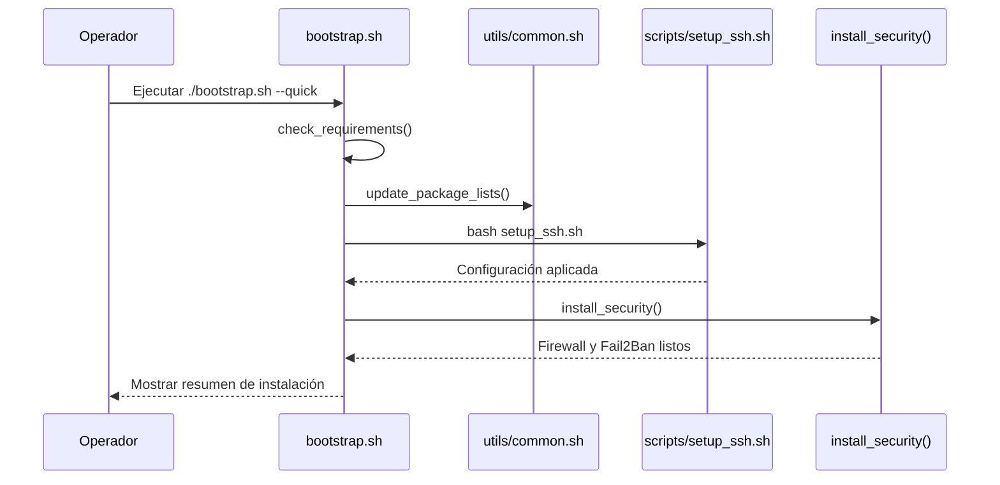

---

## UC-02 Bootstrap estándar

**Objetivo.** Desplegar el stack completo sin WireGuard: SSH, Docker, seguridad, monitoreo y backups.

**Precondiciones.** Las del caso UC-01 más disponibilidad de red para descargar Docker y Netdata opcional.

**Postcondiciones.** Docker instalado y habilitado, herramientas de monitoreo listas, cron jobs de backup registrados.

**Puntos clave en código.** `bootstrap.sh` (`install_docker`, `install_monitoring`, `setup_backups`).

#### Flujo de alto nivel

```mermaid
flowchart TD
    A[Iniciar bootstrap.sh --standard] --> B[Ejecutar flujo Quick]
    B --> C[Instalar Docker Engine + Compose]
    C --> D[Aplicar monitoreo (htop, iotop, Netdata opcional)]
    D --> E[Configurar backups automatizados]
    E --> F[Finalizar con resumen y próximos pasos]
```

#### Flujo de bajo nivel

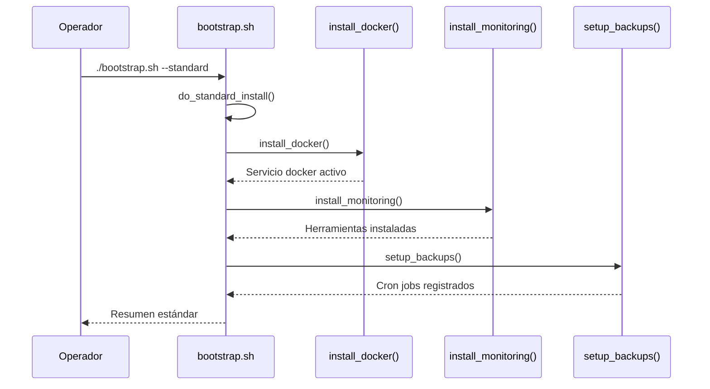

---

## UC-03 Bootstrap completo

**Objetivo.** Ejecutar el aprovisionamiento total, agregando WireGuard y medidas adicionales.

**Precondiciones.** Las de UC-02 más permisos para instalar WireGuard.

**Postcondiciones.** WireGuard instalado junto al stack estándar.

**Puntos clave en código.** `bootstrap.sh` (`do_complete_install`, `install_wireguard`).

#### Flujo de alto nivel

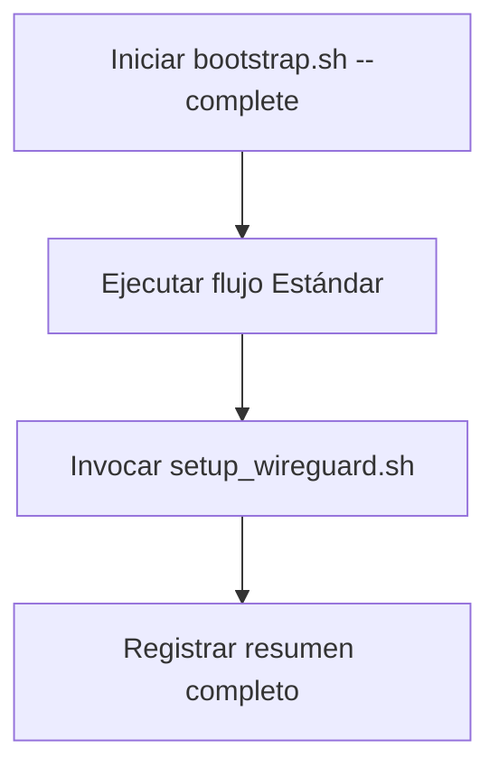

#### Flujo de bajo nivel

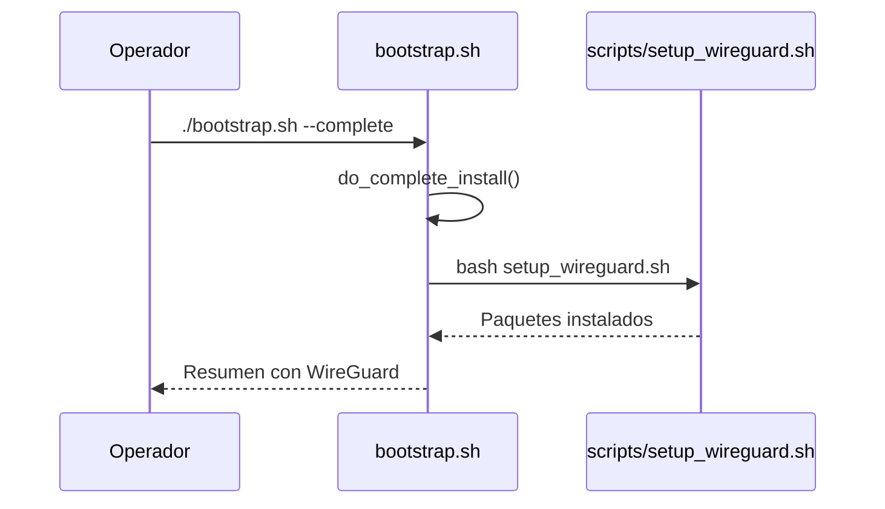

---

## UC-04 Bootstrap exclusivo del MCP

**Objetivo.** Ejecutar únicamente la provisión del servicio MCP desde el orquestador.

**Precondiciones.** Requisitos del bootstrap cumplidos, puerto MCP disponible.

**Postcondiciones.** Script `install_mcp.sh` ejecutado con éxito, servicio listo para habilitarse.

**Puntos clave en código.** `bootstrap.sh` (`run_mcp_workflow`).

#### Flujo de alto nivel

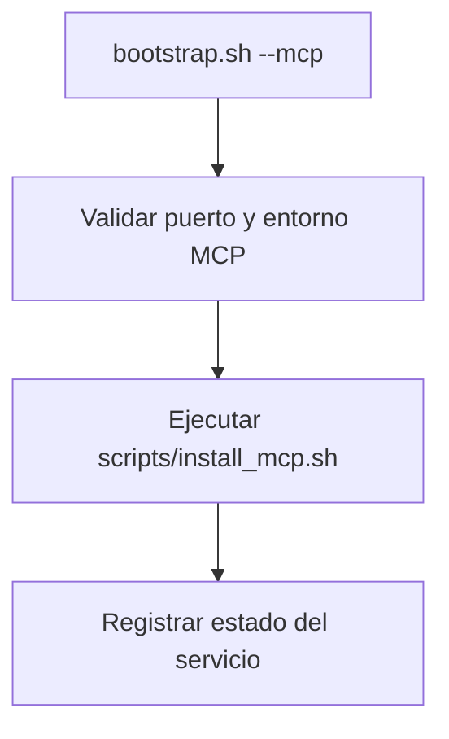

#### Flujo de bajo nivel

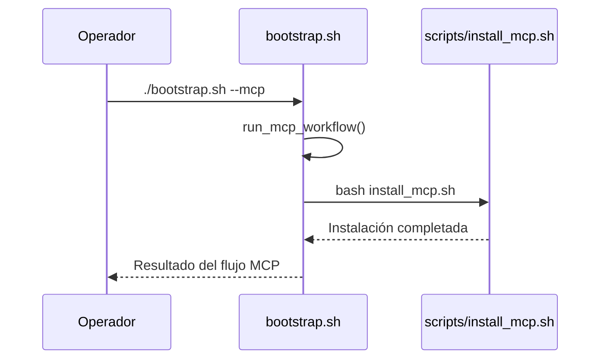

---

## UC-05 Instalación por Dev Container Feature

**Objetivo.** Permitir que un feature de Dev Container habilite componentes seleccionados al construir el contenedor.

**Precondiciones.** Variables `installDocker`, `installWireguard`, `setupSSH`, `enableMonitoring` definidas (por defecto true/false según script).

**Postcondiciones.** Componentes solicitados instalados dentro del contenedor.

**Puntos clave en código.** `scripts/feature_install.sh`.

#### Flujo de alto nivel

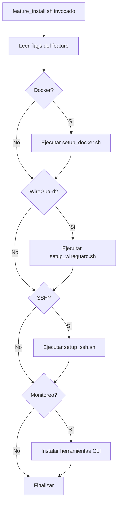

#### Flujo de bajo nivel

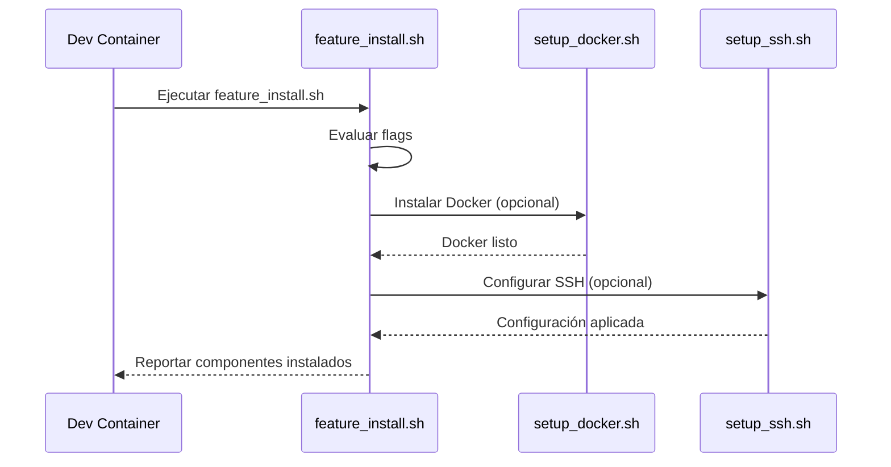

---

## UC-06 Master setup todo-en-uno

**Objetivo.** Realizar la instalación integral tradicional sin el orquestador moderno.

**Precondiciones.** Acceso sudo, scripts en `scripts/` con permisos de ejecución.

**Postcondiciones.** Docker, firewall, Fail2Ban, backups y monitoreo instalados secuencialmente.

**Puntos clave en código.** `scripts/master_setup.sh`.

#### Flujo de alto nivel

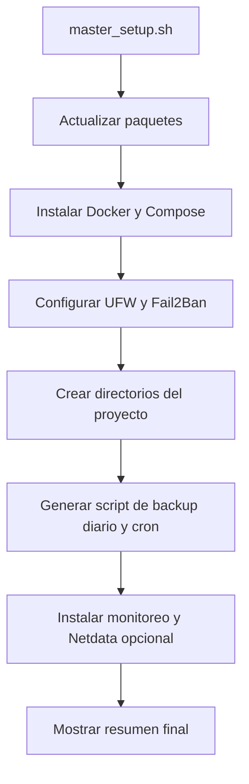

#### Flujo de bajo nivel

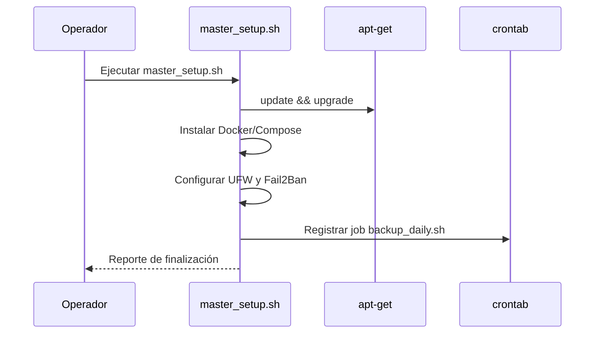

---

## UC-07 Configurar servidor SSH endurecido

**Objetivo.** Generar llaves, aplicar configuración segura y habilitar listener secundario si es posible.

**Precondiciones.** Paquetes `openssh-server` disponibles, permisos sudo.

**Postcondiciones.** `~/.ssh` poblado, `/etc/ssh/sshd_config.d/99-custom.conf` con reglas personalizadas y servicio reiniciado.

**Puntos clave en código.** `scripts/setup_ssh.sh`.

#### Flujo de alto nivel

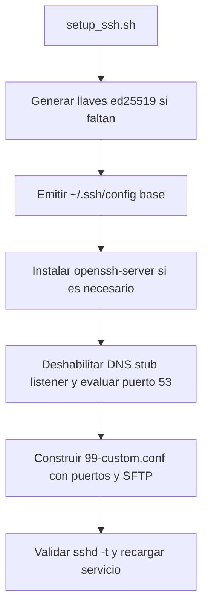

#### Flujo de bajo nivel

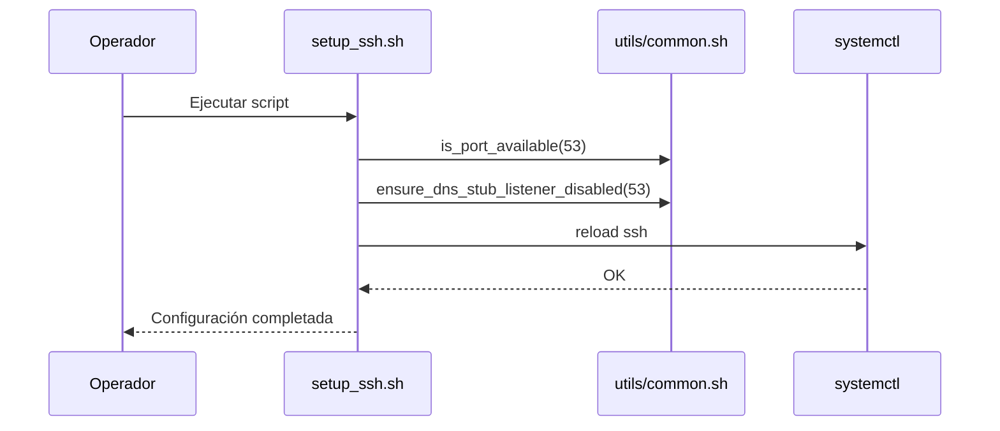

---

## UC-08 Levantar túnel SOCKS5

**Objetivo.** Crear un túnel local `ssh -D 1080` hacia el host `vpn-server` definido en `~/.ssh/config`.

**Precondiciones.** Configuración SSH creada por UC-07, conectividad hacia el host remoto.

**Postcondiciones.** Proceso en background escuchando en `localhost:1080`.

**Puntos clave en código.** `scripts/setup_tunnel.sh`.

#### Flujo de alto nivel

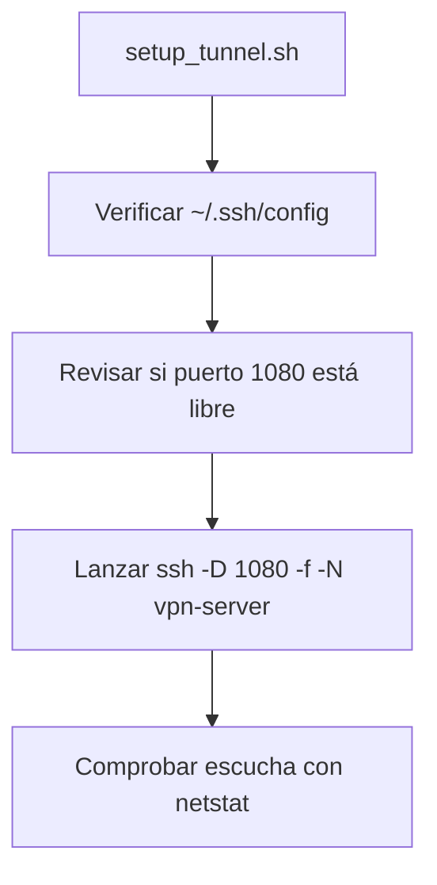

#### Flujo de bajo nivel

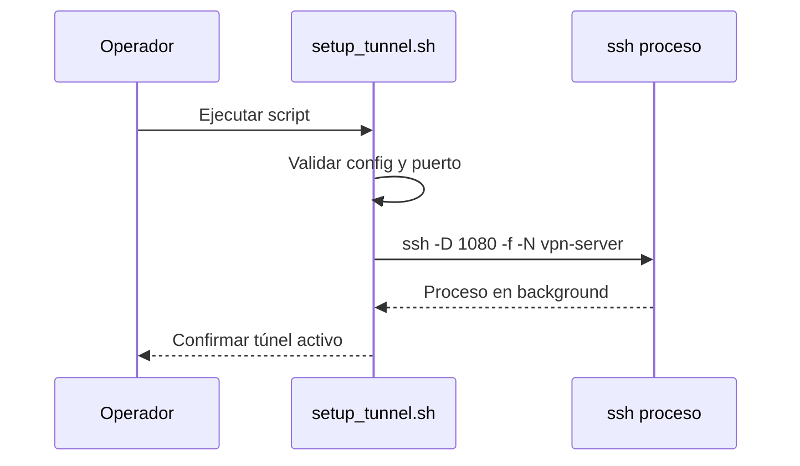

---

## UC-09 Supervisar túnel SOCKS5

**Objetivo.** Mantener activo el túnel relanzándolo cuando deja de escuchar en 1080.

**Precondiciones.** Cron o servicio invocando el script, SSH configurado.

**Postcondiciones.** Túnel reestablecido automáticamente y eventos registrados en `logs/watchdog.log`.

**Puntos clave en código.** `scripts/watchdog_tunnel.sh`.

#### Flujo de alto nivel

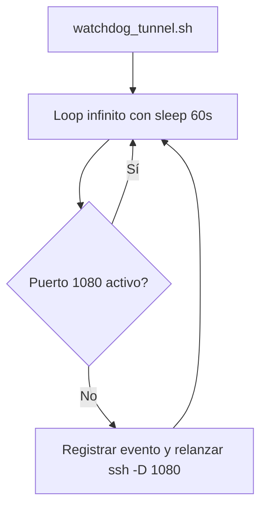

#### Flujo de bajo nivel

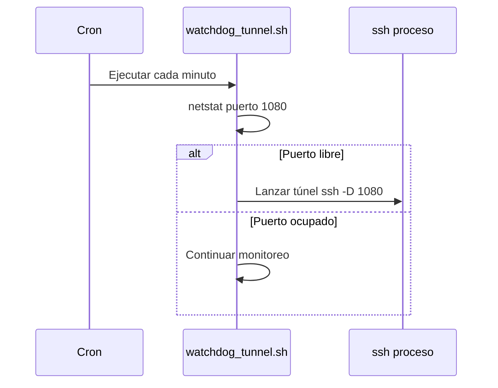

---

## UC-10 Instalar Docker Engine + Compose

**Objetivo.** Provisionar Docker y su plugin Compose, configurando políticas de logs.

**Precondiciones.** Permisos sudo, conexión a internet.

**Postcondiciones.** Docker instalado, usuario en grupo `docker`, `/etc/docker/daemon.json` creado y servicio habilitado.

**Puntos clave en código.** `scripts/setup_docker.sh`, función `install_docker()` en `bootstrap.sh`.

#### Flujo de alto nivel

```mermaid
flowchart TD
    A[setup_docker.sh o install_docker()] --> B[Detectar instalación previa]
    B --> C[Descargar script oficial de Docker]
    C --> D[Agregar usuario al grupo docker]
    D --> E[Instalar plugin docker-compose]
    E --> F[Escribir daemon.json y reiniciar servicio]
```

#### Flujo de bajo nivel

```mermaid
sequenceDiagram
    participant Script as setup_docker.sh
    participant Docker as get.docker.com
    participant Systemd as systemctl

    Script->>Docker: curl get.docker.com
    Script->>Script: sudo sh get-docker.sh
    Script->>Systemd: restart docker
    Systemd-->>Script: Docker activo
    Script-->>Script: Habilitar servicio
```

---

## UC-11 Instalar WireGuard

**Objetivo.** Instalar los paquetes necesarios para WireGuard y dejar listo el entorno para configurar `wg0`.

**Precondiciones.** Permisos sudo, repositorios apt accesibles.

**Postcondiciones.** Paquetes `wireguard` y `wireguard-tools` instalados.

**Puntos clave en código.** `scripts/setup_wireguard.sh`, `install_wireguard()`.

#### Flujo de alto nivel

```mermaid
flowchart TD
    A[setup_wireguard.sh] --> B[apt update]
    B --> C[apt install wireguard wireguard-tools]
    C --> D[Notificar configuración manual pendiente]
```

#### Flujo de bajo nivel

```mermaid
sequenceDiagram
    participant User as Operador
    participant WireGuard as setup_wireguard.sh
    participant Apt as apt-get

    User->>WireGuard: Ejecutar script
    WireGuard->>Apt: update && install paquetes
    Apt-->>WireGuard: Instalación exitosa
    WireGuard-->>User: Mensaje de configuración manual
```

---

## UC-12 Aplicar seguridad base

**Objetivo.** Activar UFW con reglas seguras y habilitar Fail2Ban.

**Precondiciones.** Acceso sudo, paquetes disponibles.

**Postcondiciones.** UFW en modo deny incoming/allow outgoing con SSH permitido y Fail2Ban ejecutándose.

**Puntos clave en código.** `install_security()` dentro de `bootstrap.sh`.

#### Flujo de alto nivel

```mermaid
flowchart TD
    A[install_security()] --> B[Instalar UFW]
    B --> C[Configurar reglas y habilitar firewall]
    C --> D[Instalar Fail2Ban]
    D --> E[Habilitar servicio fail2ban]
```

#### Flujo de bajo nivel

```mermaid
sequenceDiagram
    participant Bootstrap as bootstrap.sh
    participant Security as install_security()
    participant UFW as ufw
    participant Fail2Ban as systemctl

    Bootstrap->>Security: Ejecutar etapa de seguridad
    Security->>UFW: default deny/allow + enable
    Security->>Fail2Ban: install y enable servicio
    Fail2Ban-->>Security: Activo
    Security-->>Bootstrap: Seguridad aplicada
```

---

## UC-13 Desplegar monitoreo

**Objetivo.** Instalar herramientas de monitoreo de línea de comando y ofrecer Netdata opcional.

**Precondiciones.** Acceso a internet y sudo.

**Postcondiciones.** Paquetes `htop`, `iotop`, `nethogs`, `ncdu` instalados; Netdata opcional.

**Puntos clave en código.** `install_monitoring()` en `bootstrap.sh`.

#### Flujo de alto nivel

```mermaid
flowchart TD
    A[install_monitoring()] --> B[Instalar herramientas CLI]
    B --> C{Usuario acepta Netdata?}
    C -- Sí --> D[Descargar e instalar Netdata]
    C -- No --> E[Finalizar]
    D --> E
```

#### Flujo de bajo nivel

```mermaid
sequenceDiagram
    participant Bootstrap as bootstrap.sh
    participant Monitoring as install_monitoring()
    participant User as Operador

    Bootstrap->>Monitoring: Ejecutar etapa monitoreo
    Monitoring->>Monitoring: install_packages htop...
    Monitoring->>User: Prompt Netdata (en modo interactivo)
    alt Acepta
        Monitoring->>Netdata: curl + bash instalador
    else Rechaza
        Monitoring->>Monitoring: Registrar omisión
    end
    Monitoring-->>Bootstrap: Monitoreo listo
```

---

## UC-14 Configurar backups automatizados

**Objetivo.** Asegurar que los scripts de respaldo estén listos y cron los ejecute periódicamente.

**Precondiciones.** Scripts `backup_daily.sh` y `backup_system.sh` presentes.

**Postcondiciones.** Scripts con permisos, directorios creados y cron `/etc/cron.d/vpn_proxy_backups` con jobs diarios/semanales.

**Puntos clave en código.** `setup_backups()` en `bootstrap.sh`.

#### Flujo de alto nivel

```mermaid
flowchart TD
    A[setup_backups()] --> B[Validar scripts de backup]
    B --> C[Asegurar directorios y permisos]
    C --> D[Registrar cron diario y semanal]
```

#### Flujo de bajo nivel

```mermaid
sequenceDiagram
    participant Bootstrap as bootstrap.sh
    participant Backups as setup_backups()
    participant Cron as /etc/cron.d/vpn_proxy_backups

    Bootstrap->>Backups: Ejecutar configuración
    Backups->>Backups: chmod +x backups
    Backups->>Backups: create_directory logs/backups
    Backups->>Cron: sudo tee cron entries
    Cron-->>Backups: Jobs registrados
```

---

## UC-15 Backup diario de usuario

**Objetivo.** Ejecutar respaldo diario de configuración SSH, workspace y contenedores Docker.

**Precondiciones.** Directorios definidos en `utils/env.sh`, Docker disponible opcionalmente.

**Postcondiciones.** Archivos `.tar.gz` creados y backups antiguos (>7 días) eliminados.

**Puntos clave en código.** `scripts/backup_daily.sh`.

#### Flujo de alto nivel

```mermaid
flowchart TD
    A[backup_daily.sh] --> B[Crear tar SSH y datos de usuario]
    B --> C{Docker disponible?}
    C -- Sí --> D[Exportar contenedores a tar]
    C -- No --> E[Omitir exportación]
    D --> F[Eliminar backups antiguos]
    E --> F[Eliminar backups antiguos]
```

#### Flujo de bajo nivel

```mermaid
sequenceDiagram
    participant Cron
    participant Daily as backup_daily.sh
    participant Docker

    Cron->>Daily: Ejecutar diario 02:00
    Daily->>Daily: create_tarball ~/.ssh /etc/ssh
    alt Docker activo
        Daily->>Docker: docker export contenedores
    else
        Daily->>Daily: Registrar omisión
    end
    Daily-->>Cron: Log de finalización
```

---

## UC-16 Backup semanal del sistema

**Objetivo.** Generar copia comprimida del repositorio, scripts y llaves con retención de 7 días.

**Precondiciones.** Directorios definidos y accesibles.

**Postcondiciones.** Archivo `system_backup_*.tar.gz` creado y respaldos antiguos eliminados.

**Puntos clave en código.** `scripts/backup_system.sh`.

#### Flujo de alto nivel

```mermaid
flowchart TD
    A[backup_system.sh] --> B[Crear tar de proyecto + scripts + llaves]
    B --> C[Eliminar backups >7 días]
```

#### Flujo de bajo nivel

```mermaid
sequenceDiagram
    participant Cron
    participant Weekly as backup_system.sh

    Cron->>Weekly: Ejecutar semanal 02:30
    Weekly->>Weekly: create_tarball proyecto + scripts + ~/.ssh
    Weekly-->>Cron: Confirmar limpieza de antiguos
```

---

## UC-17 Actualización segura del sistema

**Objetivo.** Realizar actualización del sistema preservando un respaldo previo.

**Precondiciones.** Permisos sudo, espacio en disco suficiente.

**Postcondiciones.** Backup `pre_update_*.tar.gz` almacenado y sistema actualizado.

**Puntos clave en código.** `scripts/safe_update.sh`.

#### Flujo de alto nivel

```mermaid
flowchart TD
    A[safe_update.sh] --> B[Crear backup previo con create_tarball]
    B --> C[Ejecutar apt update]
    C --> D[apt upgrade -y]
    D --> E[apt autoremove -y]
```

#### Flujo de bajo nivel

```mermaid
sequenceDiagram
    participant User as Operador
    participant Update as safe_update.sh
    participant Apt as apt-get

    User->>Update: Ejecutar script
    Update->>Update: create_tarball pre_update
    Update->>Apt: update && upgrade && autoremove
    Apt-->>Update: Actualización completada
    Update-->>User: Log en logs/update.log
```

---

## UC-18 Reinicio controlado de servicios

**Objetivo.** Reiniciar servicios críticos asegurando parada limpia de Docker Compose y túneles.

**Precondiciones.** Docker Compose instalado (opcional), procesos `ssh -D 1080` potencialmente activos.

**Postcondiciones.** Servicios detenidos según disponibilidad y `sshd` reiniciado.

**Puntos clave en código.** `scripts/restart_services.sh`.

#### Flujo de alto nivel

```mermaid
flowchart TD
    A[restart_services.sh] --> B[Detener Docker Compose si existe]
    B --> C[Matar procesos de túnel ssh -D 1080]
    C --> D[Reiniciar servicio sshd]
    D --> E[Registrar finalización]
```

#### Flujo de bajo nivel

```mermaid
sequenceDiagram
    participant User as Operador
    participant Restart as restart_services.sh
    participant Docker
    participant Systemd as systemctl

    User->>Restart: Ejecutar script
    Restart->>Docker: docker compose down (opcional)
    Restart->>Restart: pkill ssh -D 1080
    Restart->>Systemd: restart sshd
    Systemd-->>Restart: sshd activo
    Restart-->>User: Log en restart_services.log
```

---

## UC-19 Health check resumido

**Objetivo.** Obtener un snapshot rápido del estado del sistema.

**Precondiciones.** Scripts y herramientas instaladas (ssh, docker, netstat, curl).

**Postcondiciones.** Reporte en stdout con estado y exit code conforme/inconforme.

**Puntos clave en código.** `scripts/health_check.sh`.

#### Flujo de alto nivel

```mermaid
flowchart TD
    A[health_check.sh] --> B[Verificar sshd activo]
    B --> C[Verificar Docker]
    C --> D[Revisar túnel 1080]
    D --> E[Probar APIs Anthropic/OpenAI]
    E --> F[Evaluar uso de disco]
    F --> G[Emitir reporte y status final]
```

#### Flujo de bajo nivel

```mermaid
sequenceDiagram
    participant User as Operador
    participant Health as health_check.sh

    User->>Health: Ejecutar script
    Health->>Health: systemctl sshd
    Health->>Health: docker ps
    Health->>Health: netstat :1080
    Health->>Health: curl APIs
    Health-->>User: Reporte HEALTHY/UNHEALTHY
```

---

## UC-20 Diagnóstico integral

**Objetivo.** Realizar auditoría completa de recursos, servicios, seguridad, actualizaciones y backups.

**Precondiciones.** Acceso a comandos del sistema (`top`, `ss`, `docker`, `ufw`, `last`, etc.).

**Postcondiciones.** Informe detallado en stdout.

**Puntos clave en código.** `scripts/diagnose_all.sh`.

#### Flujo de alto nivel

```mermaid
flowchart TD
    A[diagnose_all.sh] --> B[Recolectar info del sistema (OS, kernel, uptime)]
    B --> C[Métricas de recursos (CPU, RAM, disco)]
    C --> D[Servicios: SSH, Docker, túneles, WireGuard]
    D --> E[Seguridad: UFW, Fail2Ban, logins]
    E --> F[Conectividad APIs y actualizaciones]
    F --> G[Estado de backups]
    G --> H[Emitir resumen]
```

#### Flujo de bajo nivel

```mermaid
sequenceDiagram
    participant User as Operador
    participant Diagnose as diagnose_all.sh

    User->>Diagnose: Ejecutar script
    Diagnose->>Diagnose: detect_os_version()
    Diagnose->>Diagnose: top/free/df
    Diagnose->>Diagnose: systemctl sshd, docker ps
    Diagnose->>Diagnose: ufw status, last, apt list --upgradable
    Diagnose-->>User: Reporte integral
```

---

## UC-21 Instalación del runtime MCP

**Objetivo.** Provisionar todo lo necesario para ejecutar el servicio MCP.

**Precondiciones.** Configuración en `config/versions.conf`, permisos sudo.

**Postcondiciones.** Usuario/grupo MCP creados, directorios preparados, mise configurado, proxy Git aplicado, unit systemd desplegada.

**Puntos clave en código.** `scripts/install_mcp.sh`, `configure_language_runtimes()`, `configure_git_proxy()`.

#### Flujo de alto nivel

```mermaid
flowchart TD
    A[install_mcp.sh] --> B[Crear usuario y grupo de servicio]
    B --> C[Instalar dependencias (curl, jq, nc, python3, ripgrep)]
    C --> D[Configurar runtimes con mise]
    D --> E[Aplicar proxy Git según MCP_GIT_PROXY]
    E --> F[Crear directorios y binario placeholder]
    F --> G[Escribir mcp.env y logrotate]
    G --> H[Desplegar unidad systemd y habilitar]
```

#### Flujo de bajo nivel

```mermaid
sequenceDiagram
    participant User as Operador
    participant MCPInstall as install_mcp.sh
    participant Common as utils/common.sh
    participant Systemd as systemctl

    User->>MCPInstall: Ejecutar script
    MCPInstall->>Common: install_packages (curl jq nc python3 ripgrep)
    MCPInstall->>Common: configure_language_runtimes()
    MCPInstall->>Common: configure_git_proxy(MCP_GIT_PROXY)
    MCPInstall->>Systemd: daemon-reload && enable mcp.service
    MCPInstall-->>User: Instalación completada
```

---

## UC-22 Ejecución del servidor MCP

**Objetivo.** Levantar el binario MCP con configuración cargada y logging consistente.

**Precondiciones.** `install_mcp.sh` ejecutado, `mcp.env` existente.

**Postcondiciones.** Proceso en primer plano escribiendo logs en `${MCP_LOG_DIR}/mcp-server.log`.

**Puntos clave en código.** `scripts/run_mcp.sh`.

#### Flujo de alto nivel

```mermaid
flowchart TD
    A[run_mcp.sh] --> B[Cargar mcp.env si existe]
    B --> C[Validar ruta del binario y permisos]
    C --> D[Revisar disponibilidad del puerto MCP]
    D --> E[Ejecutar binario y redirigir logs]
```

#### Flujo de bajo nivel

```mermaid
sequenceDiagram
    participant Systemd
    participant Run as run_mcp.sh
    participant MCPBin as mcp-server binario

    Systemd->>Run: ExecStart=/scripts/run_mcp.sh
    Run->>Run: source /etc/mcp/mcp.env
    Run->>Run: Verificar permisos y puerto
    Run->>MCPBin: exec mcp-server >> logs
    MCPBin-->>Run: Salida continua
```

---

## UC-23 Watchdog del MCP

**Objetivo.** Confirmar que el servicio MCP esté accesible por red, proceso y endpoint HTTP.

**Precondiciones.** `nc`, `pgrep`, `curl` disponibles.

**Postcondiciones.** Log de verificación o salida con error si alguna prueba falla.

**Puntos clave en código.** `scripts/watchdog_mcp.sh`.

#### Flujo de alto nivel

```mermaid
flowchart TD
    A[watchdog_mcp.sh] --> B[Comprobar TCP 127.0.0.1:MCP_PORT]
    B --> C[Validar proceso con pgrep]
    C --> D[Probar endpoint HTTP /healthz]
    D --> E[Reportar estado]
```

#### Flujo de bajo nivel

```mermaid
sequenceDiagram
    participant Cron
    participant Watchdog as watchdog_mcp.sh
    participant MCP as Servicio MCP

    Cron->>Watchdog: Ejecutar script
    Watchdog->>MCP: nc -z puerto
    Watchdog->>Watchdog: pgrep -f mcp-server
    Watchdog->>MCP: curl /healthz
    Watchdog-->>Cron: Resultado de verificación
```

---

## UC-24 Configurar proxy Git para túnel

**Objetivo.** Forzar que Git utilice el túnel SOCKS5 (o limpiar la configuración) según `MCP_GIT_PROXY`.

**Precondiciones.** Git instalado, valor de proxy provisto.

**Postcondiciones.** Entradas `http.proxy`, `https.proxy` y dominios GitHub actualizados o removidos en `~/.gitconfig`.

**Puntos clave en código.** `configure_git_proxy()` en `utils/common.sh`.

#### Flujo de alto nivel

```mermaid
flowchart TD
    A[configure_git_proxy()] --> B[Verificar disponibilidad de git]
    B --> C{proxy_url vacío?}
    C -- No --> D[Escribir http/https proxy + overrides GitHub]
    C -- Sí --> E[Eliminar claves de proxy]
    D --> F[Registrar destino de proxy]
    E --> F[Registrar limpieza]
```

#### Flujo de bajo nivel

```mermaid
sequenceDiagram
    participant Script
    participant Git

    Script->>Git: git config --global http.proxy <url>
    Script->>Git: git config --global https.proxy <url>
    Script-->>Script: Registrar acción
```

---

## UC-25 Definir toolchain de lenguajes

**Objetivo.** Declarar versiones de runtimes vía `mise` para entornos MCP y desarrollo.

**Precondiciones.** Matriz `MCP_RUNTIME_TOOLCHAIN` en `config/versions.conf`.

**Postcondiciones.** Archivo `~/.config/mise/config.toml` generado y, si `mise` está instalado, activaciones globales realizadas.

**Puntos clave en código.** `configure_language_runtimes()` en `utils/common.sh`.

#### Flujo de alto nivel

```mermaid
flowchart TD
    A[configure_language_runtimes()] --> B[Leer matriz MCP_RUNTIME_TOOLCHAIN]
    B --> C[Construir archivo config.toml]
    C --> D[Loggear cada runtime]
    D --> E{Existe comando mise?}
    E -- Sí --> F[Ejecutar mise use -g tool@version]
    E -- No --> G[Registrar advertencia]
    F --> H[Finalizar]
    G --> H
```

#### Flujo de bajo nivel

```mermaid
sequenceDiagram
    participant Script
    participant Mise

    Script->>Script: Generar config.toml temporal
    Script->>Mise: mise use -g tool@version (si disponible)
    Mise-->>Script: Resultado de activación
```

---

## UC-26 Compilar CPython personalizado

**Objetivo.** Descargar, compilar e instalar una versión específica de CPython con optimizaciones.

**Precondiciones.** Dependencias de compilación disponibles, espacio en `/tmp` y `/opt`.

**Postcondiciones.** Binario instalado en `/opt/python-<versión>` con rpath configurado.

**Puntos clave en código.** `scripts/build_cpython.sh`, `scripts/build_wrapper.sh`.

#### Flujo de alto nivel

```mermaid
flowchart TD
    A[build_cpython.sh] --> B[Validar formato de versión]
    B --> C[Instalar dependencias de compilación]
    C --> D[Descargar tar.gz de python.org]
    D --> E[Extraer y configurar con optimizaciones]
    E --> F[make -j && make altinstall]
```

#### Flujo de bajo nivel

```mermaid
sequenceDiagram
    participant User as Operador
    participant Build as build_cpython.sh
    participant PythonOrg as python.org

    User->>Build: Ejecutar con versión deseada
    Build->>PythonOrg: Descargar fuente
    Build->>Build: ./configure --enable-optimizations
    Build->>Build: make -j && sudo make altinstall
    Build-->>User: Ruta de instalación final
```

---

## UC-27 Validar build de CPython

**Objetivo.** Confirmar que el build instalado corresponde a la versión esperada y funciona.

**Precondiciones.** Build completado (UC-26), ruta del binario accesible.

**Postcondiciones.** Validación exitosa o error si versión/módulos no coinciden.

**Puntos clave en código.** `scripts/validate_build.sh`, `scripts/validate_wrapper.sh`.

#### Flujo de alto nivel

```mermaid
flowchart TD
    A[validate_build.sh] --> B[Verificar existencia del binario]
    B --> C[Comprobar versión reportada]
    C --> D[Ejecutar prueba de impresión]
    D --> E[Importar módulos clave]
    E --> F[Reportar éxito]
```

#### Flujo de bajo nivel

```mermaid
sequenceDiagram
    participant User as Operador
    participant Validate as validate_build.sh
    participant Python as python binario

    User->>Validate: Ejecutar script
    Validate->>Python: --version
    Validate->>Python: -c "print(...)"
    Validate->>Python: -c "import ssl, sqlite3, zlib"
    Validate-->>User: Resultado de validación
```

---

## UC-28 Ejecutar suite de pruebas

**Objetivo.** Lanzar la batería de pruebas Python y shell con reporte de cobertura ≥80 %.

**Precondiciones.** Python 3 disponible, pip con privilegios para instalar `pytest`/`coverage` si faltan.

**Postcondiciones.** Reportes XML/HTML en `artifacts/coverage`, suites ejecutadas.

**Puntos clave en código.** `scripts/run_tests.sh`.

#### Flujo de alto nivel

```mermaid
flowchart TD
    A[run_tests.sh] --> B[Crear artifacts/coverage]
    B --> C[Instalar pytest/coverage si faltan]
    C --> D[Ejecutar pytest con coverage]
    D --> E[Generar reportes XML/HTML y fail-under 80]
    E --> F[Ejecutar tests/test_utilities.sh]
```

#### Flujo de bajo nivel

```mermaid
sequenceDiagram
    participant User as Operador
    participant Runner as run_tests.sh
    participant Pytest as coverage/pytest
    participant ShellSuite as tests/test_utilities.sh

    User->>Runner: Ejecutar script
    Runner->>Pytest: coverage run -m pytest tests
    Pytest-->>Runner: Reporte cobertura
    Runner->>ShellSuite: bash tests/test_utilities.sh
    ShellSuite-->>Runner: Resultado shell
    Runner-->>User: Artefactos generados
```

