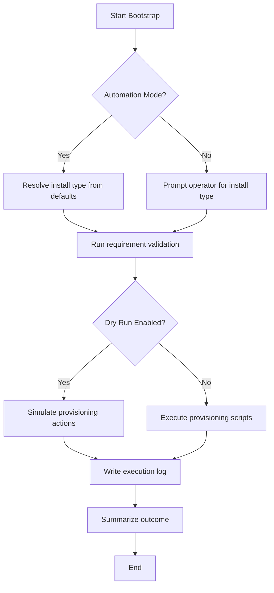
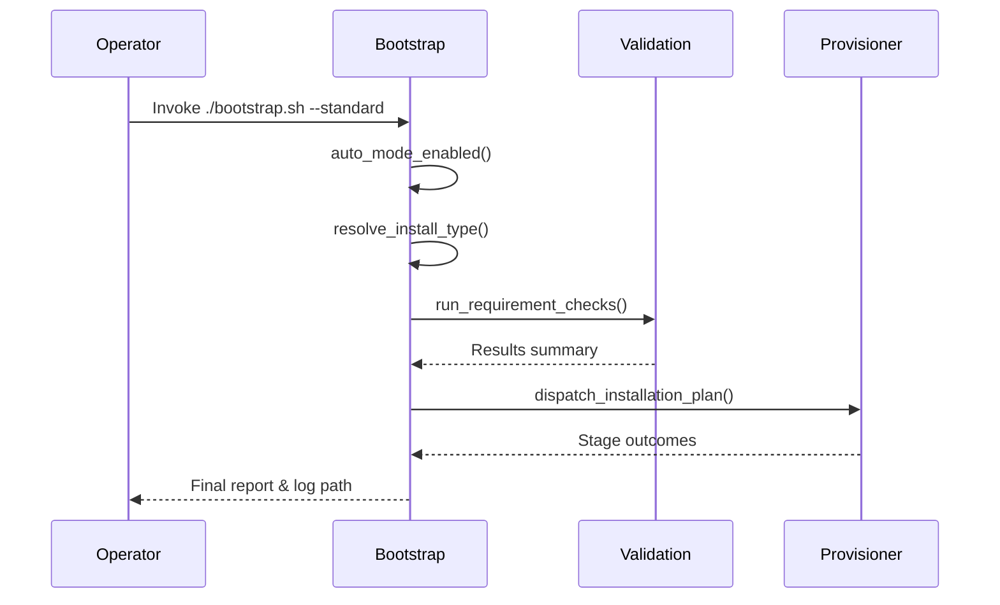

# UC01 – Bootstrap Standard Install

## Overview
The bootstrap automation without manual intervention prepares a workstation or VM by validating requirements, selecting an installation profile, and orchestrating provisioning tasks defined in `bootstrap.sh`.

## Actors
- DevOps engineer triggering provisioning
- CI automation invoking non-interactive bootstrap
- Target Ubuntu host environment

## Preconditions
- Repository cloned with executable permissions on helper scripts
- Required environment variables (e.g., `BOOTSTRAP_AUTO`) configured for automation when needed
- Network connectivity to fetch packages and dependencies

## Postconditions
- Installation type resolved (quick, standard, or complete)
- System requirements validated and logged
- Provisioning workflows triggered or simulated (in dry-run mode)
- Log file stored under `logs/` with execution transcript

## High-Level Flow
1. Detect automation and dry-run flags.
2. Resolve installation type from CLI arguments or environment variables.
3. Validate system requirements using utilities in `utils/`.
4. Execute or simulate provisioning phases (environment prep, SSH, MCP, etc.).
5. Summarize results and emit log paths for operators.

## Low-Level Flow
- `bootstrap.sh` sources `env.sh`, `logging.sh`, `validation.sh`, and `common.sh` for reusable helpers.
- The script evaluates `BOOTSTRAP_AUTO`, `CI`, and terminal interactivity to decide on automation mode.
- `resolve_install_type` normalizes CLI and environment inputs before falling back to interactive selection.
- Requirement checks invoke `run_requirement_checks` which aggregates disk, RAM, command availability, and OS validation steps.
- Depending on dry-run toggles, `log_dry_run_action` mirrors the actions without mutating the host.

## UML Activity Diagram

## UML Sequence Diagram

## Related Artifacts
- `bootstrap.sh`
- `utils/logging.sh`
- `utils/validation.sh`
