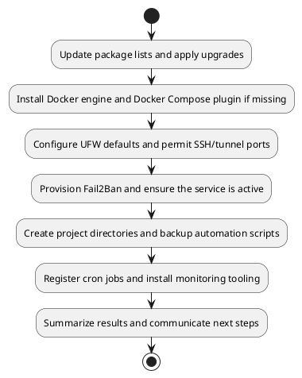
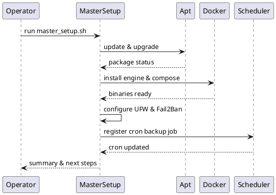

# UC02 – Master Setup Pipeline

## Overview
This use case focuses on orchestrating master setup across provisioning steps to deliver a fully configured VPN/Proxy stack through `scripts/master_setup.sh`.

## Actors
- Site reliability engineer executing a full installation
- Bootstrap automation delegating to the master setup script
- Target Ubuntu server with sudo privileges

## Preconditions
- System packages can be updated via `apt`
- User has sudo rights and, after completion, can join the docker group
- Network access to Docker installation script and optional Netdata installer

## Postconditions
- Docker engine and Compose plugin installed and configured
- UFW firewall and Fail2Ban enabled with required ports whitelisted
- Backup automation and cron tasks created under the project scripts directory
- Monitoring utilities provisioned and optional Netdata installation attempted

## High-Level Flow
1. Update package lists and apply upgrades.
2. Install Docker engine and Docker Compose plugin if missing.
3. Configure UFW defaults and permit SSH/tunnel ports.
4. Provision Fail2Ban and ensure the service is active.
5. Create project directories and backup automation scripts.
6. Register cron jobs and install monitoring tooling.
7. Summarize results and communicate next steps.

## Low-Level Flow
- `master_setup.sh` sources environment, logging, validation, and common helpers before executing `main`.
- Docker installation downloads `get-docker.sh` when `docker` is absent and adds the invoking user to the docker group.
- Firewall configuration leverages `install_packages` and `enable_service` helpers while hardening defaults.
- Backup setup writes a templated `backup_daily.sh` script, marks it executable, and rotates archives older than seven days.
- Cron configuration pipes existing entries through `crontab` to avoid duplicates before appending the backup schedule.
- Monitoring setup installs CLI tools (`htop`, `iotop`, `nethogs`, `ncdu`) and optionally runs the Netdata kickstart script.

## UML Activity Diagram

## UML Sequence Diagram

## Related Artifacts
- `scripts/master_setup.sh`
- `utils/common.sh`
- `utils/logging.sh`
