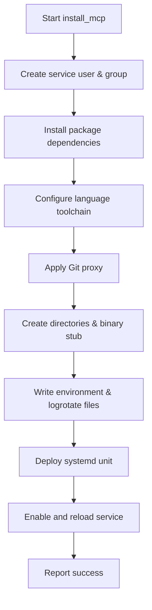
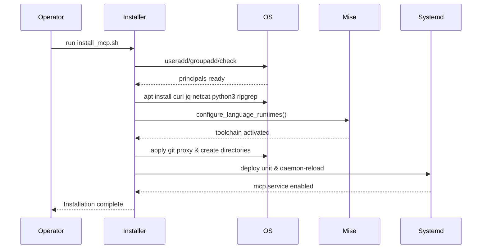

# UC03 – Install MCP Runtime

## Overview
This use case focuses on installing the MCP runtime and toolchain so the service can run with pinned dependencies and proxy-aware Git access.

## Actors
- Platform engineer provisioning the MCP service
- Bootstrap automation delegating to `scripts/install_mcp.sh`
- System services such as `systemd` and logrotate

## Preconditions
- Sudo privileges available for creating system users and writing to `/etc`
- Access to configure mise-managed language runtimes
- Network connectivity for package installations and optional proxy configuration

## Postconditions
- MCP system user, group, and directories provisioned with correct permissions
- Language toolchain defined in `config/versions.conf` configured via mise
- Git proxy configuration applied according to `MCP_GIT_PROXY`
- Placeholder MCP binary and environment/logrotate files staged under `/opt/mcp`
- `mcp.service` systemd unit installed and enabled

## High-Level Flow
1. Create or reuse system principals for the MCP service.
2. Install command-line dependencies including ripgrep and jq.
3. Configure language runtimes using mise based on toolchain configuration.
4. Apply Git proxy settings for outbound repository access when defined.
5. Prepare runtime directories, binary stub, environment file, and log rotation policy.
6. Deploy and enable the systemd unit responsible for the MCP service.

## Low-Level Flow
- `install_mcp.sh` pulls defaults from `config/versions.conf` to determine directories, ports, and usernames.
- `install_packages` ensures packages like `curl`, `jq`, `netcat`, `python3`, and `ripgrep` are installed idempotently.
- `configure_language_runtimes` populates `~/.config/mise/config.toml` and reports which languages are activated.
- `configure_git_proxy` applies SOCKS5 settings stored in `MCP_GIT_PROXY`, cleaning prior proxy directives when unset.
- Directory preparation leverages `create_directory` to set ownership and permissions before touching log files.
- The installer writes an environment file consumed by the systemd unit and configures logrotate to reload the service on rotation.

## UML Activity Diagram

## UML Sequence Diagram

## Related Artifacts
- `scripts/install_mcp.sh`
- `config/versions.conf`
- `systemd/mcp.service`
