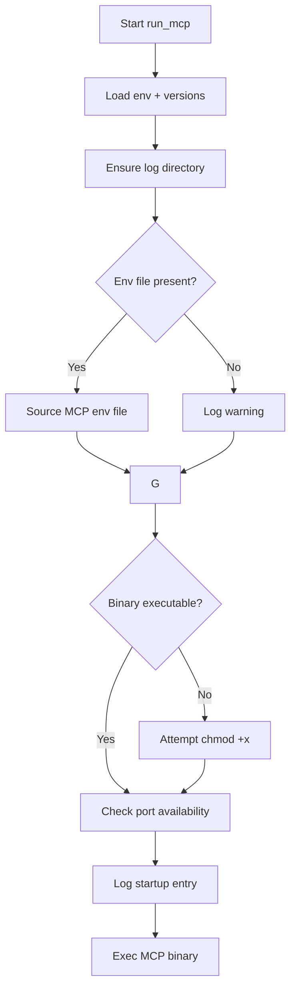
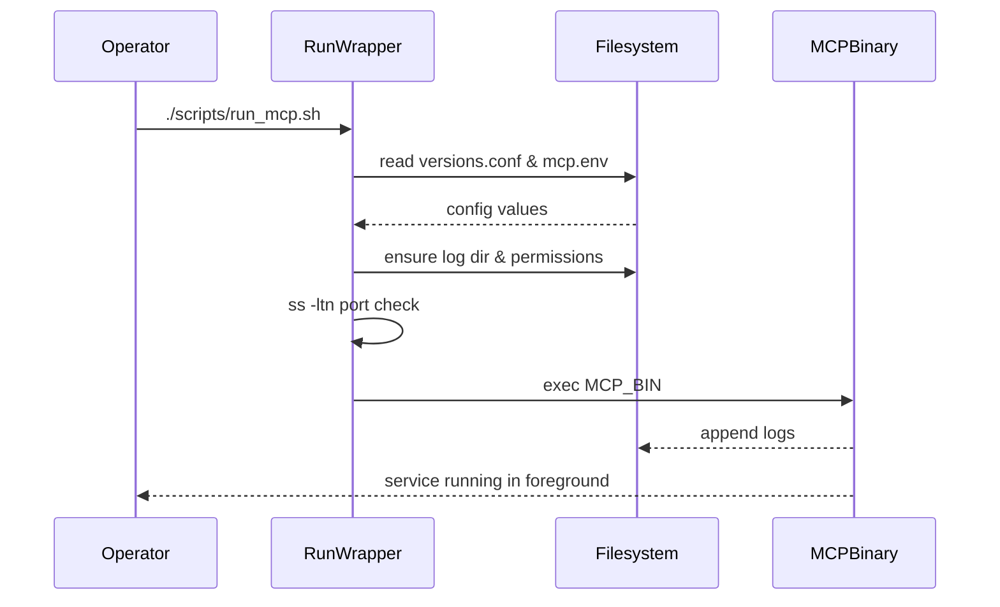

# UC04 – Run MCP Service

## Overview
This use case covers launching the MCP server under supervision, ensuring configuration files, permissions, and ports are ready before the binary executes in the foreground.

## Actors
- MCP operator starting the service manually
- Systemd service executing the wrapper
- Logging infrastructure capturing runtime events

## Preconditions
- `install_mcp.sh` has staged the environment file, binary, and log directory
- User has permission to execute the MCP binary or escalate with sudo for chmod adjustments
- The configured MCP port is available or collision warnings are acceptable

## Postconditions
- MCP environment variables loaded into the process context
- Log file initialised with startup entries
- MCP binary executed with provided arguments, inheriting stdout/stderr redirection

## High-Level Flow
1. Source shared utilities and load configuration defaults.
2. Ensure log directory exists and import environment overrides.
3. Validate binary path and execute permission, rectifying if necessary.
4. Optionally warn if the configured port is already in use.
5. Launch the MCP binary, redirecting output to the service log.

## Low-Level Flow
- The wrapper reads `config/versions.conf` to locate `MCP_LOG_DIR`, `MCP_ENV_FILE`, and `MCP_BIN_PATH`.
- If `/etc/mcp/mcp.env` exists, it is sourced to override defaults; missing files generate a warning but do not abort execution.
- When the binary lacks execute permissions, the script attempts to `chmod +x` using sudo, tolerating failures.
- Port availability is checked with `ss -ltn`, logging a warning instead of blocking when the port is busy.
- The `exec` call replaces the wrapper process with the MCP binary, redirecting both stdout and stderr to `mcp-server.log`.

## UML Activity Diagram

## UML Sequence Diagram

## Related Artifacts
- `scripts/run_mcp.sh`
- `config/versions.conf`
- `/etc/mcp/mcp.env`
