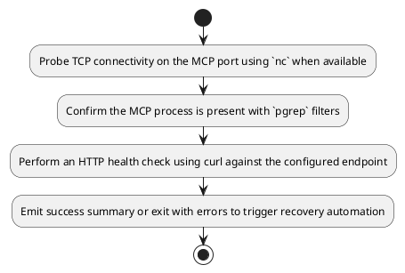
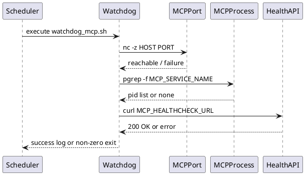

# UC05 – Watchdog MCP Recovery

## Overview
This use case ensures recovering the MCP server when health checks fail by continuously validating connectivity, process state, and HTTP health probes through `scripts/watchdog_mcp.sh`.

## Actors
- Operations engineer monitoring MCP uptime
- Cron or systemd timer invoking the watchdog periodically
- MCP server responding to probes on localhost

## Preconditions
- MCP server expected to listen on the configured TCP port
- Health endpoint exposed at `MCP_HEALTHCHECK_URL`
- `nc`, `pgrep`, and `curl` utilities installed or acceptable fallbacks identified

## Postconditions
- Successful verification logs confirm MCP availability
- Failures exit with non-zero status so supervisors can restart or alert
- Optional warnings emitted when tooling is missing but checks continue

## High-Level Flow
1. Probe TCP connectivity on the MCP port using `nc` when available.
2. Confirm the MCP process is present with `pgrep` filters.
3. Perform an HTTP health check using curl against the configured endpoint.
4. Emit success summary or exit with errors to trigger recovery automation.

## Low-Level Flow
- Default host `127.0.0.1` and port `MCP_DEFAULT_PORT` originate from `config/versions.conf` but can be overridden via environment variables.
- Each check logs its progress with `log_step`, providing consistent telemetry in automation logs.
- Missing dependencies only trigger warnings, allowing partial verification while signaling follow-up actions.
- Any failed probe exits with status 1 so supervisors like systemd can restart the MCP service based on failure conditions.

## UML Activity Diagram

## UML Sequence Diagram

## Related Artifacts
- `scripts/watchdog_mcp.sh`
- `config/versions.conf`
