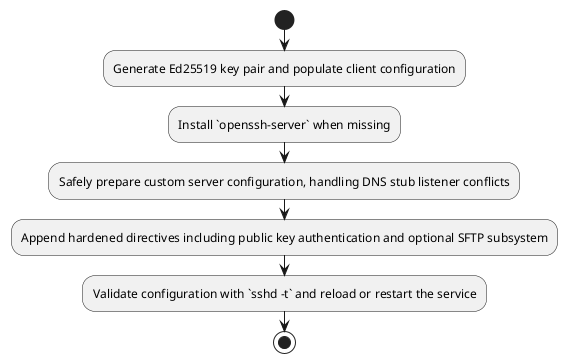
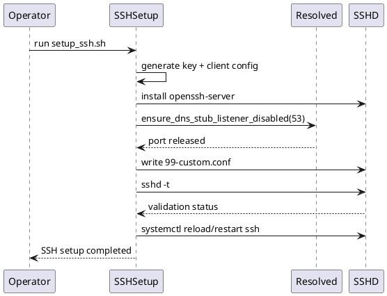

# UC06 – Setup SSH Service

## Overview
This use case handles configuring OpenSSH for dual listener tunnel access while safeguarding existing subsystem directives and ensuring the daemon reloads cleanly.

## Actors
- Infrastructure engineer preparing secure SSH access
- Bootstrap automation invoking `scripts/setup_ssh.sh`
- System services such as `systemd-resolved` and `sshd`

## Preconditions
- User has sudo privileges to modify `/etc/ssh` and restart services
- `utils/common.sh` helpers available for port validation and DNS stub adjustments
- Host supports disabling the systemd-resolved stub listener when needed

## Postconditions
- User SSH key generated if absent and client config seeded under `~/.ssh/config`
- OpenSSH server installed with hardened defaults in `sshd_config.d/99-custom.conf`
- Secondary listener on port 53 configured when available and DNS stub listener disabled if necessary
- SSH daemon reloaded or restarted after validation with `sshd -t`

## High-Level Flow
1. Generate Ed25519 key pair and populate client configuration.
2. Install `openssh-server` when missing.
3. Safely prepare custom server configuration, handling DNS stub listener conflicts.
4. Append hardened directives including public key authentication and optional SFTP subsystem.
5. Validate configuration with `sshd -t` and reload or restart the service.

## Low-Level Flow
- The script leverages `is_port_available` and `ensure_dns_stub_listener_disabled` to free port 53 before enabling a secondary listener.
- Existing SFTP subsystem declarations are detected via `sshd -T`, preventing duplicate definitions.
- Custom directives are written to `/etc/ssh/sshd_config.d/99-custom.conf` while preserving the original `sshd_config` backup for rollback.
- Validation failures restore previous configuration and abort with an error to avoid partial application.
- Service reload is preferred; a fallback restart ensures new listeners activate when reload fails.

## UML Activity Diagram

## UML Sequence Diagram

## Related Artifacts
- `scripts/setup_ssh.sh`
- `utils/common.sh`
- `utils/logging.sh`
