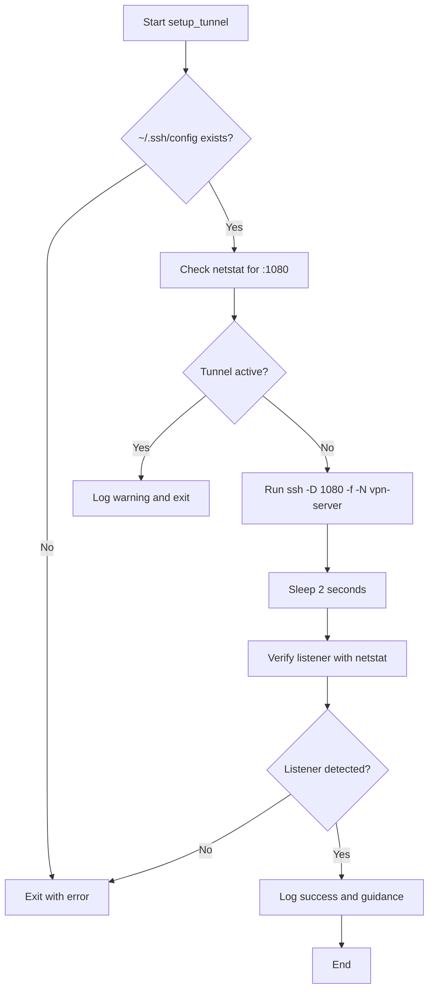
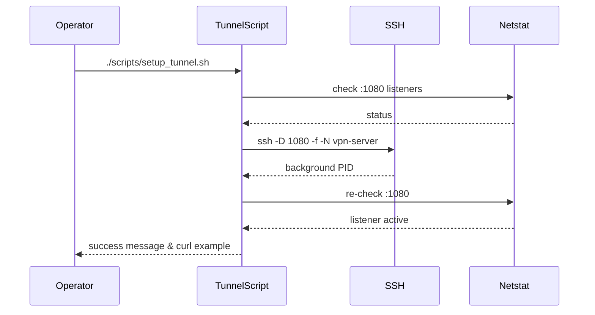

# UC07 – Setup Tunnel Listener

## Overview
This use case focuses on establishing the secondary SSH listener tunnel by creating a local SOCKS5 proxy on port 1080 that forwards through the `vpn-server` host entry.

## Actors
- Developer requiring outbound traffic through the VPN tunnel
- SSH client configured with the `vpn-server` host alias
- Local applications routing traffic through the SOCKS5 proxy

## Preconditions
- `scripts/setup_ssh.sh` has generated the SSH client configuration with a `vpn-server` host block
- SSH access credentials are available and authorized on the remote target
- Local port 1080 is free or existing tunnel instances are acceptable

## Postconditions
- Background SSH process running with `ssh -D 1080 -f -N vpn-server`
- Verification confirms port 1080 is listening locally
- Operators receive guidance for testing the tunnel via curl and SOCKS5

## High-Level Flow
1. Validate that the SSH client configuration exists.
2. Detect whether a tunnel is already running on port 1080.
3. Launch a background dynamic port forwarding session when no tunnel exists.
4. Pause briefly and verify the listener is active.
5. Provide a sample command to exercise the SOCKS5 proxy.

## Low-Level Flow
- The script depends on `netstat -tlnp` to inspect active listeners and avoid duplicate tunnels.
- SSH is invoked with `-D` for dynamic forwarding, `-f` to fork to background, and `-N` to omit remote commands.
- If the tunnel cannot start, the script exits with an error so automation can retry or alert.
- Verification reuses `netstat` to confirm the listener after a short sleep, ensuring the background process stabilizes.

## UML Activity Diagram

## UML Sequence Diagram

## Related Artifacts
- `scripts/setup_tunnel.sh`
- `scripts/setup_ssh.sh`
