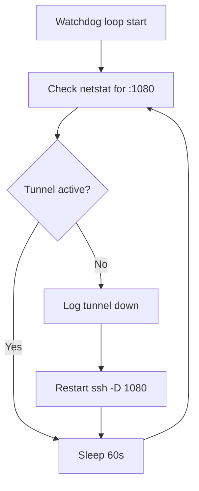
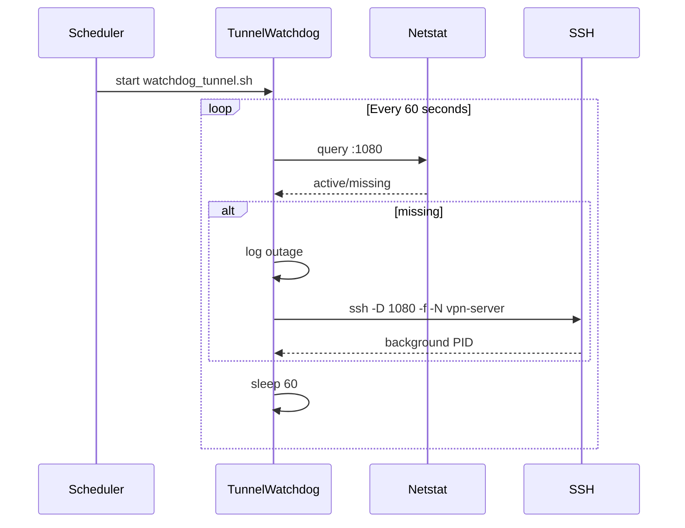

# UC08 – Watchdog Tunnel Continuity

## Overview
This use case focuses on maintaining the SSH tunnel availability by monitoring the local SOCKS5 listener and restarting it whenever the proxy disappears.

## Actors
- Operations scheduler executing the watchdog loop
- SSH client responsible for re-establishing the tunnel
- Logging system capturing tunnel restarts

## Preconditions
- `vpn-server` host alias configured for passwordless or key-based authentication
- `logs/` directory available to persist watchdog events
- Tunnel expected to listen on localhost port 1080

## Postconditions
- SOCKS5 tunnel automatically restarted when netstat no longer reports port 1080
- Log entries appended to `logs/watchdog.log` documenting downtime and restarts
- Watchdog continues looping with a 60-second cadence

## High-Level Flow
1. Inspect active listeners for the tunnel port.
2. When the tunnel is missing, log the event and relaunch SSH dynamic forwarding.
3. Sleep for 60 seconds before repeating the check.

## Low-Level Flow
- The watchdog sources `utils/env.sh` to inherit `LOGS_DIR`, ensuring log output respects repository structure.
- The `ssh -D 1080 -f -N vpn-server` command is reused for restarts, piping stderr/stdout into the log file via `tee`.
- Continuous loop ensures minimal downtime by checking each minute, suitable for cron or supervisor invocation.

## UML Activity Diagram

## UML Sequence Diagram

## Related Artifacts
- `scripts/watchdog_tunnel.sh`
- `utils/env.sh`
