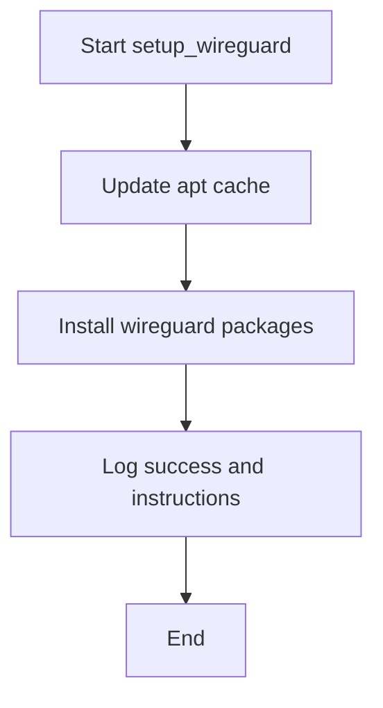
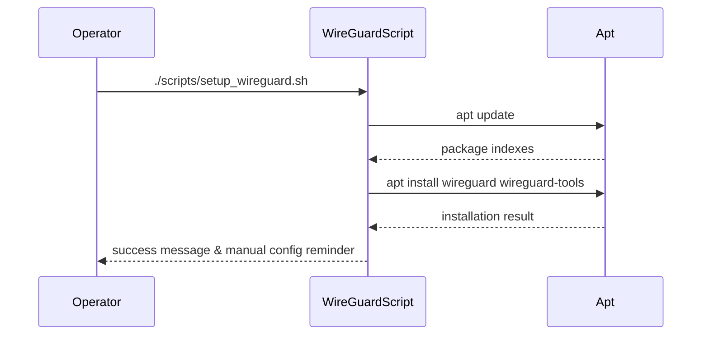

# UC09 – Setup WireGuard Gateway

## Overview
This use case focuses on preparing the WireGuard secure channel by installing kernel modules and tooling so operators can configure VPN interfaces such as `wg0`.

## Actors
- Network engineer enabling WireGuard support
- Bootstrap automation invoking `scripts/setup_wireguard.sh`
- Package manager retrieving kernel modules and utilities

## Preconditions
- System repositories configured to provide `wireguard` packages
- Sudo privileges available for package installation
- Internet connectivity to download package updates

## Postconditions
- WireGuard packages installed on the host
- Operator prompted to configure `/etc/wireguard/wg0.conf`
- System ready to bring up WireGuard interfaces manually or via automation

## High-Level Flow
1. Emit header to identify the WireGuard installation stage.
2. Update apt package lists.
3. Install `wireguard` and `wireguard-tools` packages.
4. Notify the operator to configure the interface definition file.

## Low-Level Flow
- The script runs `sudo apt update` to ensure latest package metadata before installing.
- `sudo apt install -y wireguard wireguard-tools` installs both kernel modules and userland utilities.
- No configuration files are templated; the operator is reminded to author `/etc/wireguard/wg0.conf` afterwards.

## UML Activity Diagram

## UML Sequence Diagram

## Related Artifacts
- `scripts/setup_wireguard.sh`
