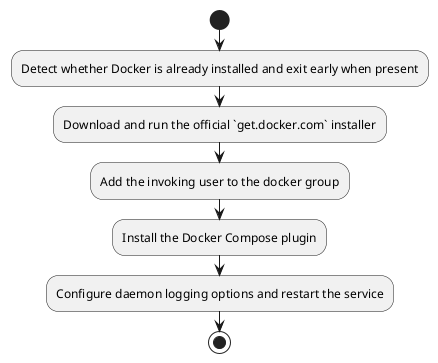
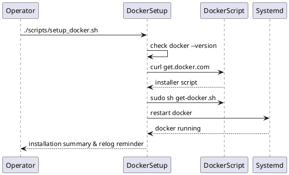

# UC10 – Setup Docker Runtime

## Overview
This use case focuses on installing and configuring Docker services so container workloads can run with managed logging and Compose support.

## Actors
- DevOps engineer enabling container tooling
- Bootstrap automation invoking `scripts/setup_docker.sh`
- Docker engine and systemd services on the host

## Preconditions
- Host has network access to download Docker installation script and packages
- Sudo privileges available for installing packages and modifying `/etc/docker`
- User session will be restarted to apply docker group membership changes

## Postconditions
- Docker engine installed via the official convenience script
- User added to the docker group for non-root container operations
- Docker Compose plugin available through apt
- `/etc/docker/daemon.json` configured with log rotation and overlay2 storage driver
- Docker service restarted and enabled at boot

## High-Level Flow
1. Detect whether Docker is already installed and exit early when present.
2. Download and run the official `get.docker.com` installer.
3. Add the invoking user to the docker group.
4. Install the Docker Compose plugin.
5. Configure daemon logging options and restart the service.

## Low-Level Flow
- Uses `curl` to stage `/tmp/get-docker.sh`, executes it with sudo, and cleans up the script afterwards.
- Calls `sudo usermod -aG docker "$USER"` so the operator can use Docker without sudo after relogging.
- Installs `docker-compose-plugin` providing `docker compose` subcommand support.
- Writes JSON configuration enabling log rotation (`max-size`, `max-file`) and sets the storage driver to overlay2.
- Restarts and enables the Docker service to apply configuration immediately and persist across reboots.

## UML Activity Diagram

## UML Sequence Diagram

## Related Artifacts
- `scripts/setup_docker.sh`
- `/etc/docker/daemon.json`
