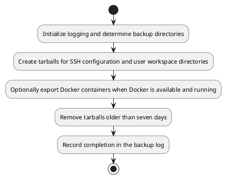
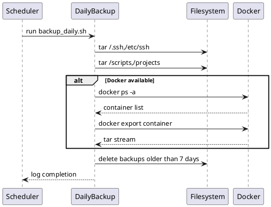

# UC11 – Backup Daily Rotations

## Overview
This use case focuses on running the lightweight daily backup rotation, capturing SSH configuration, user workspace data, and container exports while pruning archives older than a week.

## Actors
- Cron job scheduled by master setup
- Operators requiring rapid recovery snapshots
- Docker daemon supplying container exports when available

## Preconditions
- `BACKUPS_DIR` and `LOGS_DIR` paths defined via `utils/env.sh`
- Sufficient disk space to store compressed archives
- Docker installed and running for container exports (optional)

## Postconditions
- Timestamped tarballs for SSH configuration and user workspace stored in the backups directory
- Docker containers exported to `.tar` files when the daemon is accessible
- Backups older than seven days removed to conserve space
- Log entries appended to `logs/backup.log`

## High-Level Flow
1. Initialize logging and determine backup directories.
2. Create tarballs for SSH configuration and user workspace directories.
3. Optionally export Docker containers when Docker is available and running.
4. Remove tarballs older than seven days.
5. Record completion in the backup log.

## Low-Level Flow
- Relies on `create_tarball` helper to wrap tar invocations with descriptive logging.
- Uses `docker ps -a --format` to enumerate containers before exporting them with `docker export`.
- Employs `find` with `-mtime +7` to identify aged backups across `.tar.gz` and `.tar` files.
- Logging uses `log_file` to append messages directly to `logs/backup.log`, ensuring historical traceability.

## UML Activity Diagram

## UML Sequence Diagram

## Related Artifacts
- `scripts/backup_daily.sh`
- `utils/common.sh`
- `utils/logging.sh`
