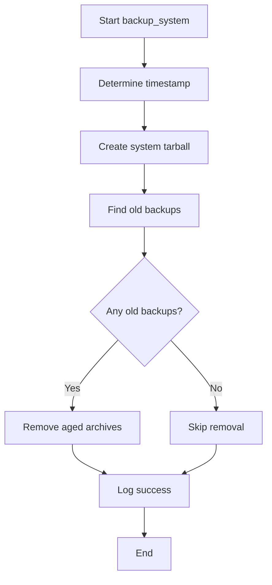
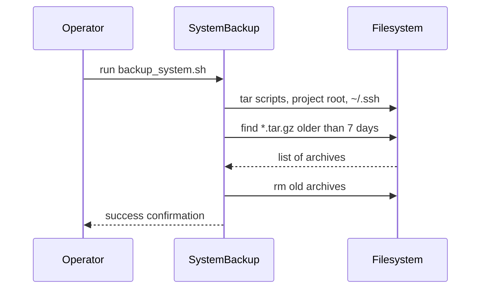

# UC12 – Backup System Snapshot

## Overview
This use case focuses on performing comprehensive system backups by archiving the scripts directory, project root, and SSH credentials into a timestamped tarball.

## Actors
- Operations engineer creating an ad-hoc snapshot
- Cron or automation requiring full-system archives
- Filesystem storage retaining backups under `BACKUPS_DIR`

## Preconditions
- Paths such as `PROJECT_ROOT`, `SCRIPTS_DIR`, and `BACKUPS_DIR` resolved by `utils/env.sh`
- Adequate disk space for the combined archive
- Read access to the project root and SSH configuration directories

## Postconditions
- Tarball named `system_backup_<timestamp>.tar.gz` stored in the backups directory
- Backups older than seven days removed
- Success message logged via `log_success`

## High-Level Flow
1. Compute timestamp and target archive path.
2. Invoke `create_tarball` to package project directories and SSH configuration.
3. Prune prior system backups older than seven days.
4. Log completion and archive name.

## Low-Level Flow
- Utilizes `create_tarball` helper for consistent logging and error handling during tar creation.
- Applies `find` with `-mtime +7` to clean aged system backups and logs the cleanup action.
- Finishes with `log_success`, enabling automation to parse positive outcomes from standard output.

## UML Activity Diagram

## UML Sequence Diagram

## Related Artifacts
- `scripts/backup_system.sh`
- `utils/common.sh`
