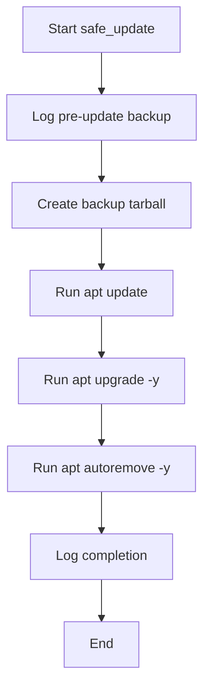
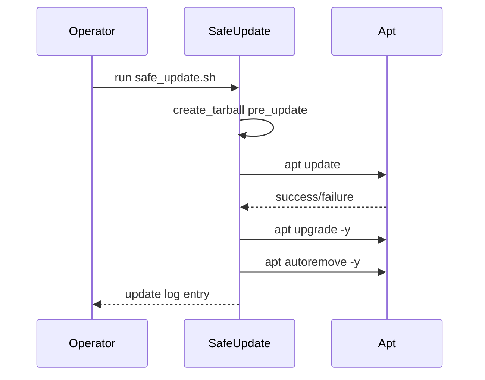

# UC13 – Safe Update Stack

## Overview
This use case focuses on executing safe rolling updates by snapshotting the system before applying package upgrades and recording activity to an update log.

## Actors
- Operations engineer applying OS updates
- Automation ensuring hosts remain current
- Apt package manager performing upgrades

## Preconditions
- Sudo privileges for running apt commands
- `BACKUPS_DIR` and `LOGS_DIR` defined to store pre-update archives and logs
- Sufficient disk space to hold a temporary backup of the project and SSH assets

## Postconditions
- Pre-update tarball stored as `pre_update_<timestamp>.tar.gz`
- System packages updated via `apt update`, `apt upgrade -y`, and `apt autoremove -y`
- Log entries appended to `logs/update.log`

## High-Level Flow
1. Generate timestamped backup filename and initialize logging.
2. Create an archive capturing project, scripts, and SSH keys.
3. Run apt update/upgrade/autoremove commands.
4. Log completion for auditing purposes.

## Low-Level Flow
- Uses `create_tarball` to ensure consistent error handling while archiving the project state.
- Each major stage records status into `logs/update.log` using `log_file` for append-only auditing.
- Apt commands run sequentially so failures abort the script due to `set -euo pipefail`.

## UML Activity Diagram

## UML Sequence Diagram

## Related Artifacts
- `scripts/safe_update.sh`
- `utils/common.sh`
- `utils/logging.sh`
