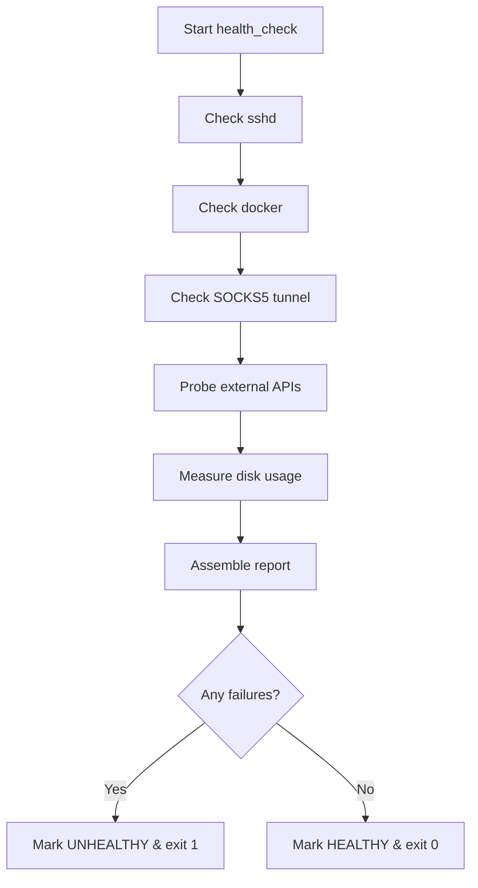
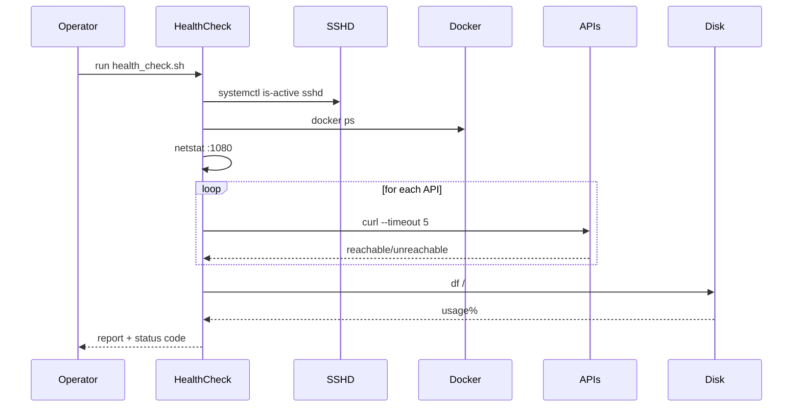

# UC14 – Health Check Monitoring

## Overview
This use case focuses on capturing health telemetry across services by auditing SSH, Docker, SOCKS5 tunnel status, critical APIs, and disk usage to produce an actionable report.

## Actors
- Operations staff performing routine health checks
- Automation scheduler (cron/systemd timers)
- Target services including sshd, Docker daemon, and external APIs

## Preconditions
- Access to `systemctl`, `docker`, `netstat`, `curl`, and `df` utilities
- Outbound network connectivity for API reachability tests
- Permissions to query system services and disk usage metrics

## Postconditions
- Multi-line report summarizing the state of core services and resources
- Non-zero exit status when any check fails, enabling alerting
- Disk usage warnings triggered when usage exceeds 80% and critical errors above 90%

## High-Level Flow
1. Verify SSH service status.
2. Confirm Docker daemon availability.
3. Inspect SOCKS5 tunnel listener on port 1080.
4. Test reachability of key third-party APIs.
5. Evaluate disk utilization thresholds.
6. Output consolidated report and status code.

## Low-Level Flow
- Aggregates output strings into `REPORT`, appending `[OK]`, `[WARN]`, or `[ERROR]` markers per check.
- Utilizes `timeout` with curl to bound API latency and convert network failures into actionable errors.
- Applies `df` parsing to derive disk usage percentage, with warning and critical thresholds.
- Final status determined by the `HEALTHY` flag; script exits 1 when any component is unhealthy.

## UML Activity Diagram

## UML Sequence Diagram

## Related Artifacts
- `scripts/health_check.sh`
- `utils/logging.sh`
