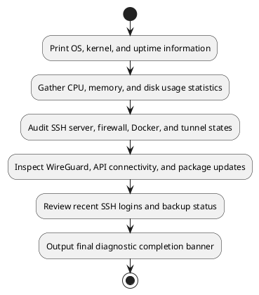
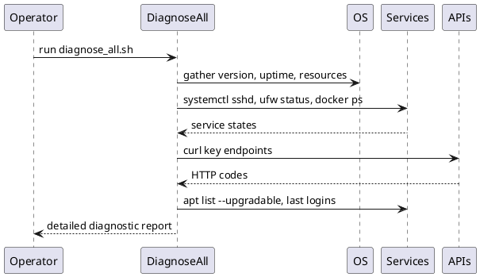

# UC15 – Diagnose All Tooling

## Overview
This use case focuses on running the full diagnostics suite to capture operating system details, service states, network readiness, and maintenance signals for the VPN/Proxy stack.

## Actors
- Support engineer troubleshooting incidents
- Automation triggered during health audits
- System services such as sshd, Docker, WireGuard, and UFW

## Preconditions
- Utilities including `top`, `free`, `df`, `ss`, `docker`, `ufw`, `curl`, and `wg` available where applicable
- Permissions to read system status, query services, and inspect logs
- Network access for API reachability tests

## Postconditions
- Console report summarizing OS information, resources, services, security posture, and backups
- API connectivity status for Anthropic, OpenAI, and Copilot proxy endpoints
- Update availability, recent logins, and backup inventory presented for follow-up actions

## High-Level Flow
1. Print OS, kernel, and uptime information.
2. Gather CPU, memory, and disk usage statistics.
3. Audit SSH server, firewall, Docker, and tunnel states.
4. Inspect WireGuard, API connectivity, and package updates.
5. Review recent SSH logins and backup status.
6. Output final diagnostic completion banner.

## Low-Level Flow
- Uses `detect_os_version` from `utils/validation.sh` to populate OS metadata.
- Computes CPU and memory usage via `top` and `free`, formatting percentages with `awk`.
- Enumerates Docker containers, images, and volumes when Docker is installed.
- Leverages `netstat` and `ip link` for tunnel and WireGuard checks, respectively.
- API tests rely on `curl` with a 5-second timeout, accepting HTTP 200 or 405 responses as success.
- Package updates counted using `apt list --upgradable`, while `last` reports recent SSH activity.

## UML Activity Diagram

## UML Sequence Diagram

## Related Artifacts
- `scripts/diagnose_all.sh`
- `utils/validation.sh`
- `utils/common.sh`
