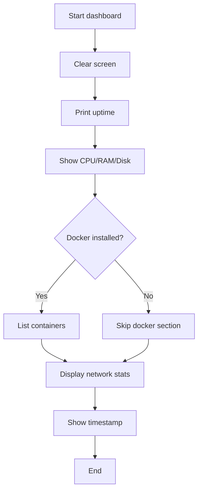
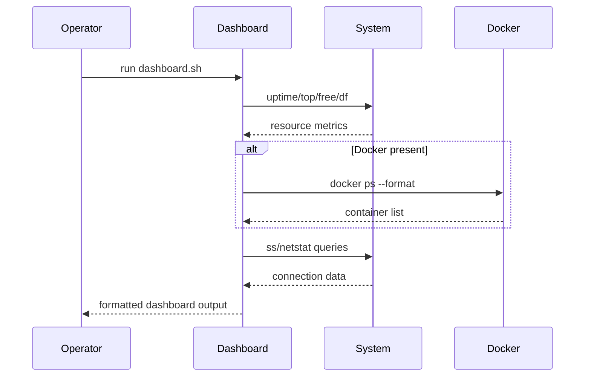

# UC16 – Dashboard Status Board

## Overview
This use case focuses on rendering operational dashboard summaries to provide a quick snapshot of system uptime, resource usage, container health, and tunnel status.

## Actors
- On-call engineer needing a quick operational view
- Local terminal session displaying status output
- Docker daemon supplying container metadata

## Preconditions
- Terminal capable of clearing the screen and running CLI utilities
- Optional Docker installation for container status reporting
- `ss` and `netstat` tools available for connection counts

## Postconditions
- Terminal output summarizing uptime, CPU, RAM, disk, Docker containers, SSH connections, and tunnel availability
- Warnings surfaced when the SOCKS5 tunnel is inactive or Docker is unavailable
- Timestamp indicating when the snapshot was captured

## High-Level Flow
1. Clear the terminal and print header banners.
2. Display uptime and system resource usage.
3. List running Docker containers when Docker is installed.
4. Show SSH connection counts and tunnel status.
5. Print timestamp for the dashboard snapshot.

## Low-Level Flow
- Uses `uptime -p`, `top`, `free`, and `df` to display resource metrics in human-readable form.
- When Docker is installed, `docker ps --format` enumerates container names and statuses; errors fall back to a warning.
- SSH connection counts derived from `ss -tnp | grep :22 | wc -l` provide insight into active sessions.
- Tunnel status determined by `netstat -tlnp` search for `:1080`, highlighting whether the SOCKS5 proxy is active.

## UML Activity Diagram

## UML Sequence Diagram

## Related Artifacts
- `scripts/dashboard.sh`
- `utils/logging.sh`
