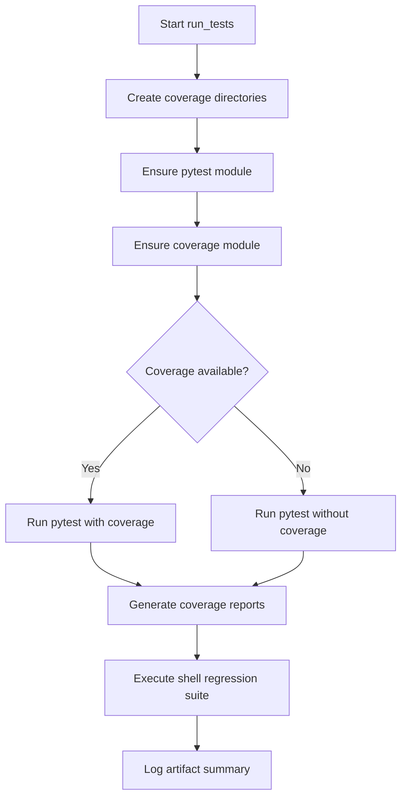
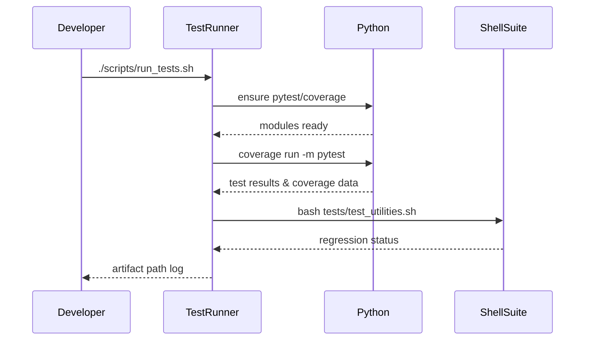

# UC17 – Run Tests Pipeline

## Overview
This use case focuses on triggering the validation test harness by executing Python and shell suites with coverage enforcement and artifact generation.

## Actors
- Developer validating changes locally
- CI pipeline ensuring quality gates
- Python interpreter and bash shell executing tests

## Preconditions
- Python interpreter available (default `python3` or overridden via `PYTHON`)
- Ability to install Python modules such as pytest and coverage when missing
- Shell regression suite executable at `tests/test_utilities.sh`

## Postconditions
- Pytest executed with coverage metrics (unless coverage module unavailable)
- Shell regression suite run after Python tests
- Coverage XML and HTML reports stored under `artifacts/coverage`
- Pipeline fails if coverage falls below 80%

## High-Level Flow
1. Prepare artifacts directory for coverage outputs.
2. Ensure required Python modules are installed or downgrade expectations when coverage is missing.
3. Run pytest with coverage and generate reports.
4. Execute shell regression suite.
5. Summarize artifact locations.

## Low-Level Flow
- `ensure_python_tool` attempts to run `python -m <module> --version` before invoking pip; coverage absence downgrades the run to non-coverage mode.
- `coverage report --fail-under=80` enforces minimum coverage, matching repository policy.
- Shell suite executed via `bash tests/test_utilities.sh` ensures shell helpers remain functional.
- Final log message indicates where artifacts are written for CI collection.

## UML Activity Diagram

## UML Sequence Diagram

## Related Artifacts
- `scripts/run_tests.sh`
- `tests/test_utilities.sh`
