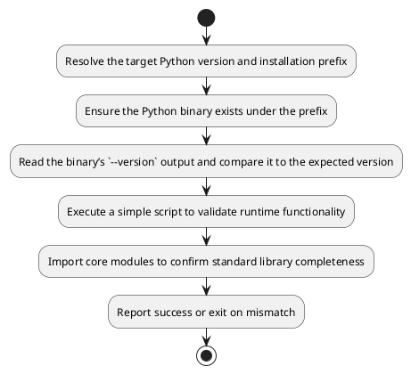
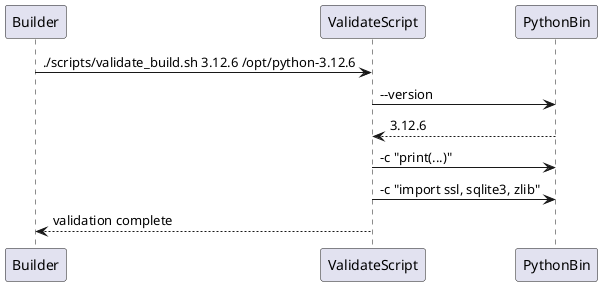

# UC18 – Validate Build Artifacts

## Overview
This use case focuses on validating build deliverables by confirming a compiled Python installation matches the expected version and supports essential modules.

## Actors
- Build engineer verifying compiled Python artifacts
- CI pipeline performing acceptance checks
- Target Python interpreter installed under `/opt`

## Preconditions
- Python build already installed at the specified prefix
- Access to `utils/logging.sh` and `utils/validation.sh` helpers
- Ability to execute the built Python binary

## Postconditions
- Binary existence verified via `validate_file_exists`
- Version string compared against expectation and mismatches flagged
- Basic execution test prints greeting message
- Core modules (`ssl`, `sqlite3`, `zlib`) successfully imported

## High-Level Flow
1. Resolve the target Python version and installation prefix.
2. Ensure the Python binary exists under the prefix.
3. Read the binary’s `--version` output and compare it to the expected version.
4. Execute a simple script to validate runtime functionality.
5. Import core modules to confirm standard library completeness.
6. Report success or exit on mismatch.

## Low-Level Flow
- Defaults to version 3.12.6 and prefix `/opt/python-<version>` but accepts overrides via CLI arguments.
- Uses `validate_file_exists` to produce consistent error messaging when binaries are missing.
- Captures version output using `awk '{print $2}'` to isolate the semantic version string.
- Executes inline Python commands for runtime and module verification, failing fast on ImportError.

## UML Activity Diagram

## UML Sequence Diagram

## Related Artifacts
- `scripts/validate_build.sh`
- `utils/validation.sh`
