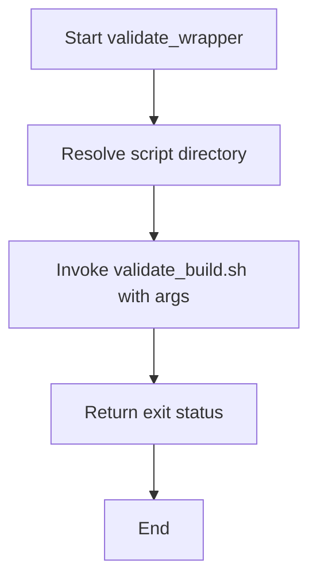
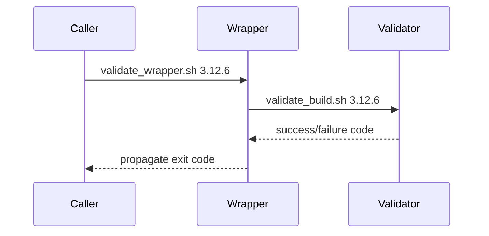

# UC19 – Validate Wrapper Entrypoint

## Overview
This use case focuses on wrapping validation with environment preparation by delegating CLI invocations to the underlying Python build validator.

## Actors
- CI job invoking the simpler wrapper interface
- Engineers who prefer a stable entrypoint even if the underlying script evolves
- `validate_build.sh` script performing actual validation

## Preconditions
- `validate_build.sh` present and executable in the same directory
- Arguments provided to the wrapper align with the validator’s CLI contract
- Shell has permission to execute both scripts

## Postconditions
- Arguments forwarded to `validate_build.sh`
- Exit code mirrors the delegated script
- Wrapper ensures `set -euo pipefail` semantics apply to the delegated execution

## High-Level Flow
1. Resolve script directory relative to the wrapper file.
2. Execute `validate_build.sh` with all provided arguments.
3. Propagate exit status to the caller.

## Low-Level Flow
- Uses Bash parameter expansion to find the wrapper’s directory reliably.
- Employs direct execution (`"${SCRIPT_DIR}/validate_build.sh" "$@"`) without subshells, preserving exit codes and signals.

## UML Activity Diagram

## UML Sequence Diagram

## Related Artifacts
- `scripts/validate_wrapper.sh`
- `scripts/validate_build.sh`
