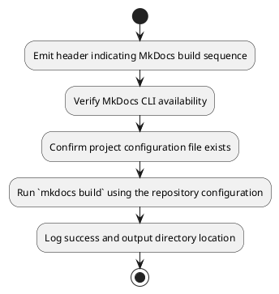
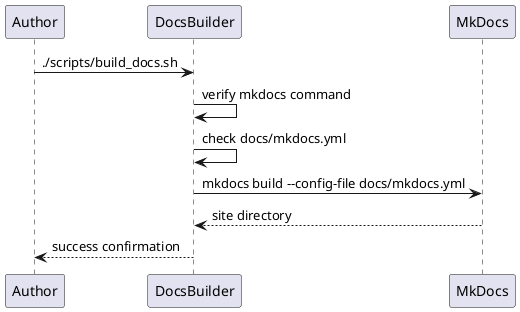

# UC20 – Build Docs Pipeline

## Overview
This use case focuses on building and publishing documentation by invoking MkDocs locally, ensuring configuration integrity before generating the static site.

## Actors
- Technical writer preparing documentation previews
- CI/CD job producing MkDocs artifacts
- MkDocs CLI and configuration files within the repository

## Preconditions
- MkDocs installed and available on the PATH
- `docs/mkdocs.yml` present and correctly configured
- Repository dependencies installed via `make docs-deps` when needed

## Postconditions
- MkDocs build executed with the project configuration file
- Static site generated under the `site/` directory
- Errors surfaced immediately when MkDocs is missing or configuration absent

## High-Level Flow
1. Emit header indicating MkDocs build sequence.
2. Verify MkDocs CLI availability.
3. Confirm project configuration file exists.
4. Run `mkdocs build` using the repository configuration.
5. Log success and output directory location.

## Low-Level Flow
- Uses `command -v mkdocs` to guard against missing dependencies and instructs the operator to install docs dependencies when absent.
- Validates configuration by checking for `docs/mkdocs.yml`, preventing silent failures.
- Executes `mkdocs build --config-file docs/mkdocs.yml` to generate the static site into `site/`.

## UML Activity Diagram

## UML Sequence Diagram

## Related Artifacts
- `scripts/build_docs.sh`
- `docs/mkdocs.yml`
