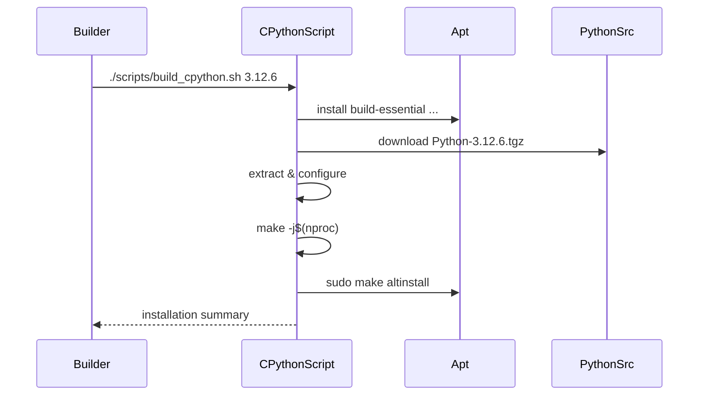

# UC21 – Build CPython from Source

## Overview
This use case focuses on building CPython from upstream sources, installing the interpreter under a versioned prefix with optimization flags suitable for production workloads.

## Actors
- Build engineer compiling custom Python versions
- Automation preparing language runtimes for MCP
- Package manager providing compilation dependencies

## Preconditions
- Sudo privileges for installing build dependencies and performing `make altinstall`
- Network access to download CPython source tarball
- Adequate disk space under `/tmp` and the installation prefix

## Postconditions
- Build dependencies installed on the host
- CPython source downloaded, extracted, configured, and compiled
- Optimized interpreter installed under `/opt/python-<version>` (or provided prefix)
- Output reminding operators to add the installation to their PATH

## High-Level Flow
1. Validate requested Python version format.
2. Install compilation dependencies via apt.
3. Download the CPython source tarball for the target version.
4. Extract the source into the build directory.
5. Configure with optimizations, shared library, and RPATH settings.
6. Compile and install using `make altinstall`.

## Low-Level Flow
- Uses `validate_python_version_format` to enforce semantic version strings before proceeding.
- `install_packages` ensures libraries such as `libssl-dev`, `zlib1g-dev`, and build tools are present.
- `download_file` and `extract_tarball` (from `utils/common.sh`) manage source retrieval and extraction.
- Configure step enables PGO-friendly optimizations, LTO, and shared library support while setting `LDFLAGS` for runtime linking.
- `make -j$(nproc)` maximizes CPU utilization; `sudo make altinstall` prevents overwriting system Python symlinks.

## UML Activity Diagram
```mermaid
flowchart TD
    A[Start build_cpython] --> B[Validate version format]
    B --> C[Install build dependencies]
    C --> D[Download Python source]
    D --> E[Extract tarball]
    E --> F[Configure build options]
    F --> G[make -j$(nproc)]
    G --> H[make altinstall]
    H --> I[Log success & PATH hint]
```

## UML Sequence Diagram


## Related Artifacts
- `scripts/build_cpython.sh`
- `utils/common.sh`
- `utils/validation.sh`
