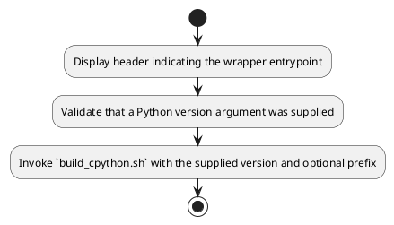
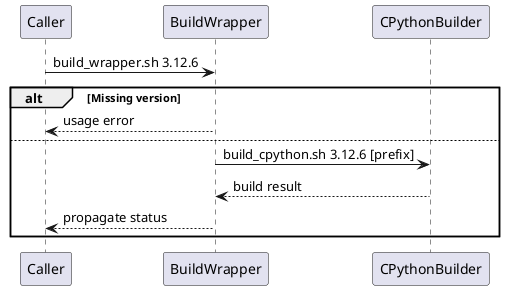

# UC22 – Build Wrapper CI Integration

## Overview
This use case focuses on integrating builds with the wrapper tooling by presenting a friendly interface that delegates to the CPython build script with version validation messaging.

## Actors
- CI jobs invoking a simplified command signature
- Engineers requesting manual CPython builds
- Underlying `build_cpython.sh` script executing compilation steps

## Preconditions
- `build_cpython.sh` located alongside the wrapper and executable
- Version argument supplied when running the wrapper
- Optional installation prefix provided as a second argument

## Postconditions
- Input validation ensures a version is supplied; otherwise the script exits with usage guidance
- Delegation to `build_cpython.sh` using provided arguments
- Exit code mirrors the delegated build outcome

## High-Level Flow
1. Display header indicating the wrapper entrypoint.
2. Validate that a Python version argument was supplied.
3. Invoke `build_cpython.sh` with the supplied version and optional prefix.

## Low-Level Flow
- Uses `log_error` and `log_info` for consistent usage messaging when no version argument is provided.
- Executes the builder via `"${SCRIPT_DIR}/build_cpython.sh" "$1" "$2"`, allowing optional prefix propagation while preserving `set -euo pipefail` semantics.

## UML Activity Diagram

## UML Sequence Diagram

## Related Artifacts
- `scripts/build_wrapper.sh`
- `scripts/build_cpython.sh`
