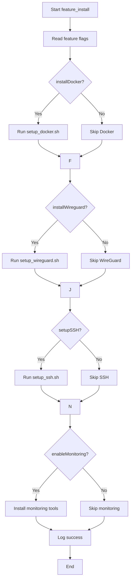
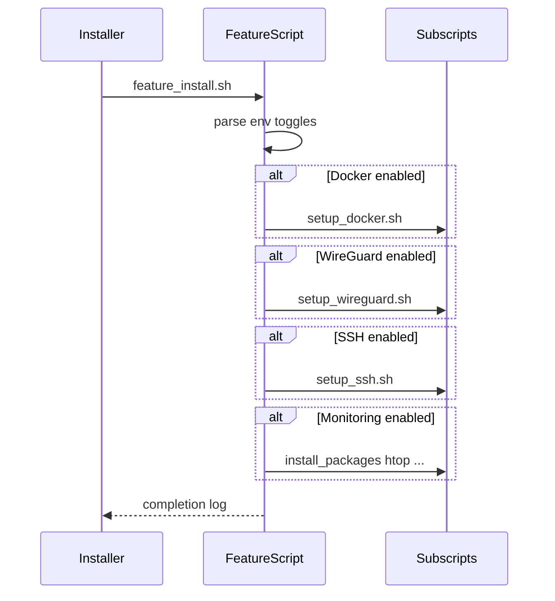

# UC23 – Feature Install Customization

## Overview
This use case focuses on installing optional feature bundles by reading devcontainer-style toggles and orchestrating Docker, WireGuard, SSH, and monitoring setup scripts accordingly.

## Actors
- Devcontainer feature installer invoking the script with environment overrides
- Operators customizing local development environments
- Dependent setup scripts (`setup_docker.sh`, `setup_wireguard.sh`, `setup_ssh.sh`)

## Preconditions
- Environment variables such as `installDocker`, `installWireguard`, `setupSSH`, and `enableMonitoring` exported when customization is desired
- Scripts for Docker, WireGuard, and SSH setup present and executable
- Sudo privileges available for package installation when features enabled

## Postconditions
- Selected features installed or configured based on boolean flags
- Monitoring tools (`htop`, `iotop`, `nethogs`, `ncdu`) installed when enabled
- Success message emitted summarizing feature installation completion

## High-Level Flow
1. Read feature toggles from environment variables.
2. Conditionally invoke Docker, WireGuard, and SSH setup scripts based on toggles.
3. Install monitoring packages when enabled.
4. Log overall success.

## Low-Level Flow
- Defaults enable Docker, SSH, and monitoring, while WireGuard is optional (`false`).
- Each conditional block logs intent before executing the corresponding script or installing packages.
- Monitoring packages installed via `install_packages` helper to ensure idempotence.

## UML Activity Diagram

## UML Sequence Diagram

## Related Artifacts
- `scripts/feature_install.sh`
- `scripts/setup_docker.sh`
- `scripts/setup_wireguard.sh`
- `scripts/setup_ssh.sh`
