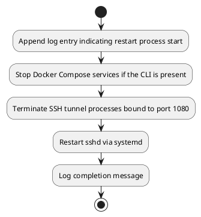
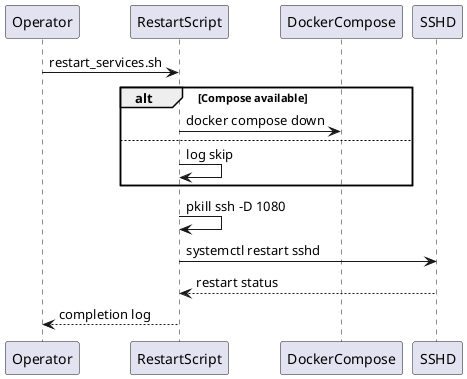

# UC24 – Restart Services Recovery

## Overview
This use case focuses on recovering core services via restart by gracefully stopping Docker Compose workloads, terminating stale tunnels, and restarting sshd with logging.

## Actors
- Operations engineer performing maintenance
- Automation pipeline responding to incident remediation
- System services including Docker Compose and sshd

## Preconditions
- `docker compose` available when container workloads should be managed
- Permissions to send signals to SSH tunnel processes and restart sshd via sudo
- `logs/` directory writable for restart logs

## Postconditions
- Docker Compose stack stopped when available
- Existing SSH tunnel processes terminated to avoid orphaned sockets
- `sshd` service restarted successfully
- Activity logged to `logs/restart_services.log`

## High-Level Flow
1. Append log entry indicating restart process start.
2. Stop Docker Compose services if the CLI is present.
3. Terminate SSH tunnel processes bound to port 1080.
4. Restart sshd via systemd.
5. Log completion message.

## Low-Level Flow
- Uses `log_file` helper to append to the restart log at each step.
- Docker Compose detection ensures the script tolerates hosts without Compose by logging a skip message.
- Tunnel processes identified with `pgrep -f "ssh.*-D.*1080"` and terminated via `pkill -f`.
- `sudo systemctl restart sshd` ensures new configuration changes take effect or recovers from faults.

## UML Activity Diagram

## UML Sequence Diagram

## Related Artifacts
- `scripts/restart_services.sh`
- `utils/logging.sh`
