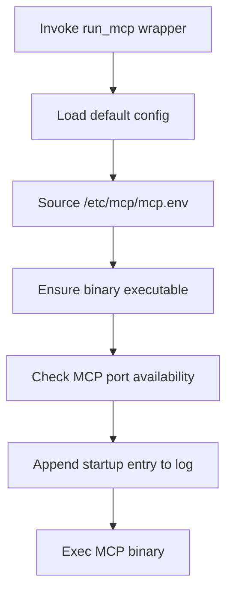
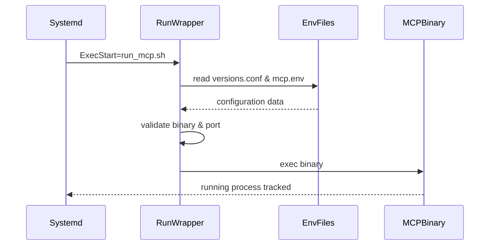

# UC25 – Run MCP Wrapper

## Overview
This use case focuses on bridging MCP execution through wrapper scripts by coordinating systemd, watchdogs, and the `run_mcp.sh` launcher to provide a consistent entrypoint for the service binary.

## Actors
- Systemd unit `mcp.service` invoking the wrapper
- Operations engineer manually starting the service
- Watchdog scripts validating runtime health

## Preconditions
- `install_mcp.sh` has staged the wrapper, environment file, and binary path
- `mcp.service` configured to call the wrapper or operator available to run it manually
- Log directory writable for appending runtime telemetry

## Postconditions
- Wrapper exports environment variables and hands off control to the MCP binary
- stdout and stderr redirected into the MCP log file for auditing
- Downstream watchdogs can monitor the process knowing the wrapper standardizes launch semantics

## High-Level Flow
1. Systemd or an operator calls `scripts/run_mcp.sh`.
2. Wrapper sources environment defaults and optional overrides from `/etc/mcp/mcp.env`.
3. Validates binary permissions and port availability.
4. Executes the MCP binary in the foreground with log redirection.

## Low-Level Flow
- Wrapper ensures environment variables defined in `config/versions.conf` are loaded before sourcing `/etc/mcp/mcp.env` for overrides.
- Missing execute permissions trigger a corrective `chmod +x` attempt, preventing failures after artifact deployments.
- Port collision check emits warnings instead of aborting so supervisors can decide whether to restart or relocate services.
- Final `exec` replaces the wrapper, allowing systemd and watchdog scripts to track the MCP process directly.

## UML Activity Diagram

## UML Sequence Diagram

## Related Artifacts
- `scripts/run_mcp.sh`
- `systemd/mcp.service`
- `scripts/watchdog_mcp.sh`
