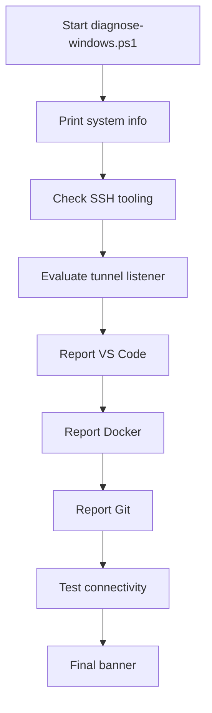
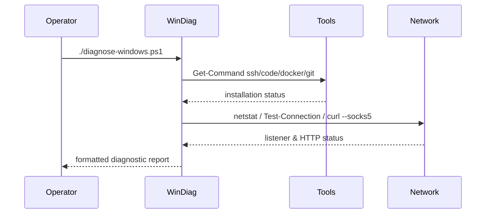

# UC26 – Backup Windows Diagnostics

## Overview
This use case focuses on running Windows diagnostics from PowerShell to mirror the Linux diagnostic capabilities, ensuring SSH, tunnel, editor, container, and connectivity readiness on Windows hosts.

## Actors
- Windows operator validating development environment readiness
- PowerShell terminal executing the script
- Installed tooling such as SSH, VS Code, Docker, and Git

## Preconditions
- PowerShell with access to commands like `ssh`, `netstat`, `code`, `docker`, `git`, and `Test-Connection`
- SOCKS5 tunnel optionally available on localhost:1080
- Network connectivity for external reachability tests

## Postconditions
- Console report summarizing installation and status of SSH, tunnel, VS Code, Docker, Git, and connectivity checks
- Proxy validation attempted against Anthropic API when the tunnel is active
- Operators informed about missing tooling or inactive services for remediation

## High-Level Flow
1. Display Windows system metadata and PowerShell version.
2. Inspect SSH installation and client configuration.
3. Check SOCKS5 tunnel listener state.
4. Report VS Code, Docker, and Git availability.
5. Test direct connectivity and proxy reachability.
6. Print closing banner summarizing diagnostics.

## Low-Level Flow
- Uses `Get-Command` to detect tool availability and prints `[OK]`, `[WARN]`, or `[ERROR]` markers accordingly.
- Reads `~/.ssh/config` host entries when present to confirm VPN configuration.
- Relies on `netstat -an` to detect the tunnel and, when active, issues a proxied `curl.exe` request to Anthropic API verifying HTTP status 200/405.
- `Test-Connection` validates baseline internet connectivity to Google before proxy tests.

## UML Activity Diagram

## UML Sequence Diagram

## Related Artifacts
- `scripts/windows/diagnose-windows.ps1`
