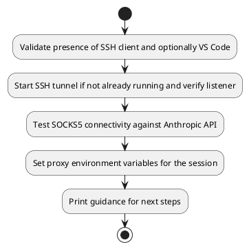
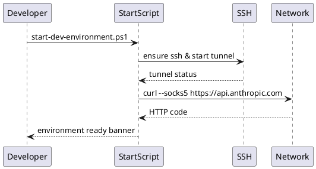

# UC27 – Windows Start Environment

## Overview
This use case focuses on starting the Windows development environment by ensuring required tools exist, launching the SSH tunnel, validating connectivity, and exporting proxy variables.

## Actors
- Windows developer initializing the workstation
- PowerShell executing the startup script
- Remote VPN host defined as `vpn-server`

## Preconditions
- SSH client installed and configured with a `vpn-server` host entry
- Optional VS Code installation for remote development workflows
- Credentials authorized to establish the tunnel on the remote host

## Postconditions
- SSH tunnel established on localhost:1080 (if not already active)
- Proxy environment variables `HTTP_PROXY` and `HTTPS_PROXY` set to the tunnel endpoint
- API connectivity validated via SOCKS5 request to Anthropic
- Console instructions displayed for remote VS Code usage and tunnel teardown

## High-Level Flow
1. Validate presence of SSH client and optionally VS Code.
2. Start SSH tunnel if not already running and verify listener.
3. Test SOCKS5 connectivity against Anthropic API.
4. Set proxy environment variables for the session.
5. Print guidance for next steps.

## Low-Level Flow
- `Get-Process` ensures duplicate tunnels are avoided before launching `ssh -D 1080 -f -N vpn-server`.
- `netstat -an` verifies the listener after a two-second stabilization period.
- Proxy test leverages `curl.exe --socks5` to confirm remote API accessibility.
- Environment variables applied using PowerShell’s `$env:` scope for the current session.

## UML Activity Diagram

## UML Sequence Diagram

## Related Artifacts
- `scripts/windows/start-dev-environment.ps1`
