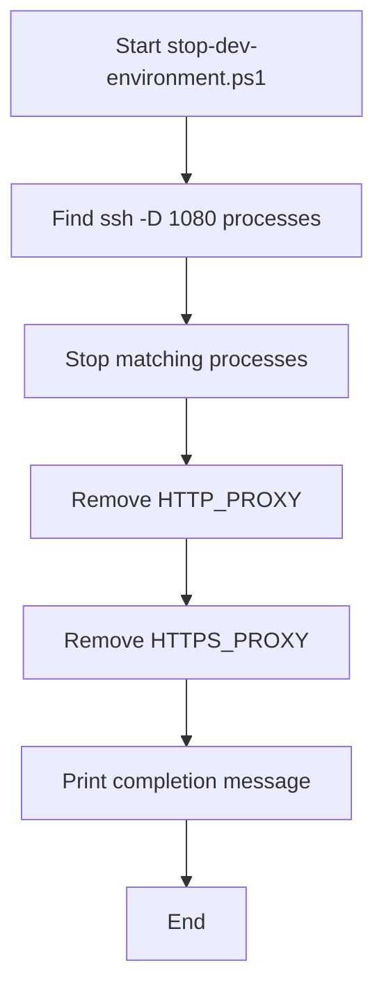
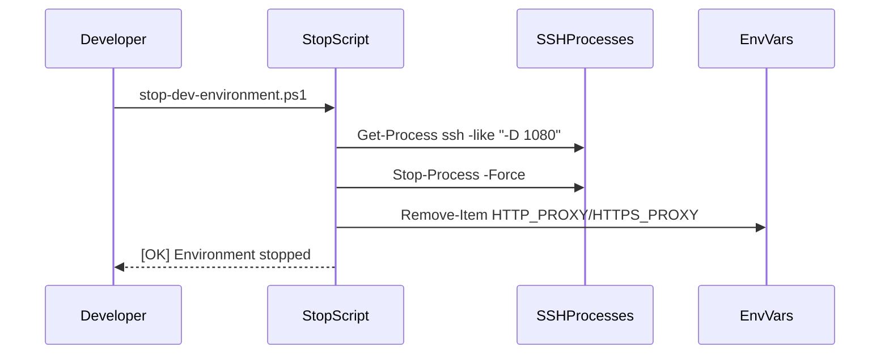

# UC28 – Windows Stop Environment

## Overview
This use case focuses on stopping the Windows development environment by terminating active SSH tunnels and clearing proxy environment variables to restore the host state.

## Actors
- Windows developer shutting down the VPN tooling
- PowerShell executing the stop script
- Running SSH processes providing SOCKS5 tunneling

## Preconditions
- SSH tunnel previously established via `start-dev-environment.ps1`
- Proxy environment variables potentially set in the current session
- PowerShell permissions to terminate SSH processes

## Postconditions
- All SSH processes running with `-D 1080` terminated
- `HTTP_PROXY` and `HTTPS_PROXY` variables removed from the environment
- Confirmation message printed indicating shutdown success

## High-Level Flow
1. Identify SSH processes providing SOCKS5 tunneling.
2. Forcefully stop those processes.
3. Remove proxy environment variables from the session.
4. Notify the operator that the environment is stopped.

## Low-Level Flow
- Uses `Get-Process ssh` with command-line filtering to locate tunnel processes specifically bound to port 1080.
- Applies `Stop-Process -Force` to guarantee termination, preventing orphaned tunnels.
- `Remove-Item Env:` commands clear proxy variables while tolerating absent entries via `-ErrorAction SilentlyContinue`.

## UML Activity Diagram

## UML Sequence Diagram

## Related Artifacts
- `scripts/windows/stop-dev-environment.ps1`
